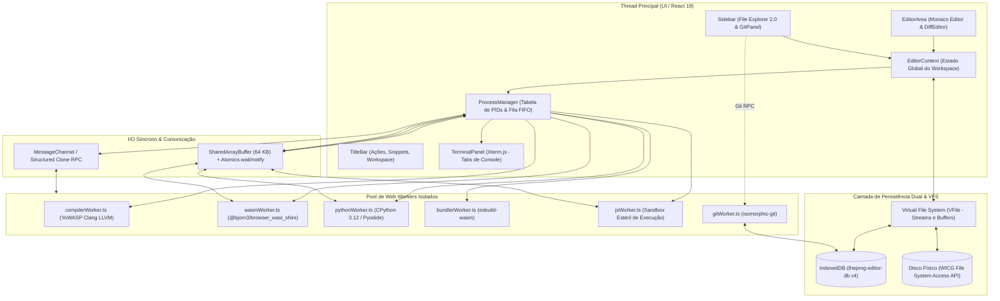
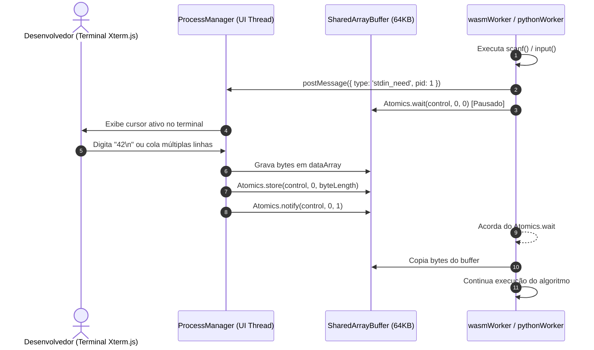
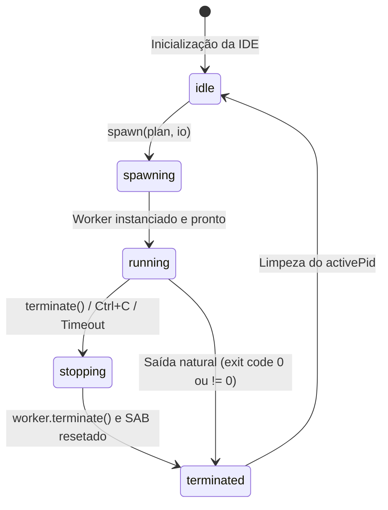

# 🏛️ 01_ARCHITECTURE.md — Arquitetura de Sistemas, Concorrência e Conexões

> **TheProg Editor — Documentação Técnica Canônica**  
> *Versão do Sistema: `v0.6.0`*

---

## 1. Visão Geral da Arquitetura

O **TheProg Editor** é uma estação de desenvolvimento web integrada concebida sob os paradigmas de **computação 100% client-side, isolamento estrito de threads secundárias e operação offline-first**. 

Ao contrário de plataformas de código tradicionais na web (que despacham fontes para servidores de compilação ou instanciam contêineres Docker remotos), o TheProg Editor executa todas as fases do ciclo de desenvolvimento de software — **edição, análise sintática, empacotamento, compilação de código nativo, interpretação e versionamento Git** — diretamente dentro da sandbox do navegador do usuário.



---

## 2. Modelo de Concorrência & Threading

Para manter a interface reativa a 60/120 FPS mesmo durante compilações pesadas de C++ com otimizações `-O2` ou inicialização de grandes interpretadores, a aplicação aplica **segregação absoluta de tarefas**:

### 2.1 Papel da Thread Principal (UI Thread)
- Renderização dos componentes React 19 ([`App.tsx`](file:///src/App.tsx), [`Sidebar.tsx`](file:///src/components/layout/Sidebar.tsx), [`EditorArea.tsx`](file:///src/components/layout/EditorArea.tsx), [`TerminalPanel.tsx`](file:///src/components/layout/TerminalPanel.tsx)).
- Instância do editor de texto Monaco (`@monaco-editor/react`) e tratamento de eventos de teclado.
- Emulação do console com Xterm.js 6 (`@xterm/xterm`) e renderização em canvas.
- Roteamento e orquestração do ciclo de vida dos processos através do singleton [`ProcessManager`](file:///src/services/process/processManager.ts).
- Gestão do sistema de arquivos e sincronização com o disco físico via WICG File System Access API.

> [!IMPORTANT]
> **Regra de Ouro da UI Thread:** Nenhuma rotina de parsing pesado, cálculo criptográfico (SHA-1 de commits), compilação Clang ou execução de código de usuário pode executar na UI thread. Todo processamento intensivo é delegado para workers secundários.

### 2.2 Pool de Web Workers Especializados

| Worker | Arquivo Fonte | Biblioteca Subjacente | Propósito Arquitetural |
| :--- | :--- | :--- | :--- |
| **Compiler Worker** | [`compilerWorker.ts`](file:///src/workers/compilerWorker.ts) | `@yowasp/clang` (LLVM Clang Wasm) | Compilação C/C++ para binários WebAssembly (`.wasm`). |
| **WASI Runner Worker** | [`wasmWorker.ts`](file:///src/workers/wasmWorker.ts) | `@bjorn3/browser_wasi_shim` | Ambiente WASI estéril para execução de binários compilados. |
| **Python Worker** | [`pythonWorker.ts`](file:///src/workers/pythonWorker.ts) | `pyodide` (CPython WebAssembly) | Interpretador Python completo com `micropip` e `black`. |
| **Bundler Worker** | [`bundlerWorker.ts`](file:///src/workers/bundlerWorker.ts) | `esbuild-wasm` | Resolução e bundling de módulos ES/CommonJS locais. |
| **JavaScript Worker** | [`jsWorker.ts`](file:///src/workers/jsWorker.ts) | Sandbox Nativo JS | Execução esterilizada de código JS/TS transpilado. |
| **Git Worker** | [`gitWorker.ts`](file:///src/workers/gitWorker.ts) | `isomorphic-git` | Diffs, hashing SHA-1, árvore de objetos e commits locais. |

---

## 3. Protocolos de Comunicação entre Threads

A arquitetura utiliza duas vias complementares de comunicação entre a UI thread e os workers:

### 3.1 Canal Assíncrono: MessageChannel & Structured Clone RPC
- Utilizado para comandos de controle, inicialização de runtimes, transferência de planos de compilação (`RunPlan`), sincronização de arquivos gerados (`fs_sync`) e eventos de saída de texto assíncronos (`stdout`/`stderr`).
- Todas as mensagens enviadas pela thread principal carregam o `pid` do processo atual. Se um worker demorado responder com uma mensagem associada a um `pid` já finalizado ou cancelado, o [`ProcessManager`](file:///src/services/process/processManager.ts) descarta o pacote imediatamente, eliminando ruídos em execuções subsequentes.

### 3.2 Canal Síncrono: `SharedArrayBuffer` & `Atomics` (I/O de Baixa Latência)
- Linguagens como C (`scanf()`, `getchar()`, `fgets()`), C++ (`std::cin`) e Python (`input()`) realizam chamadas bloqueantes síncronas de sistema. Em navegadores, o JavaScript da thread de UI não pode ser bloqueado (sob pena de travar a aba).
- Para resolver esse conflito, os workers de execução pausam sua thread chamando:
  ```typescript
  // Worker suspende sua execução até que a UI thread libere dados
  Atomics.wait(controlInt32Array, 0, 0);
  ```
- A thread principal captura a digitação do usuário no Xterm.js ou drena sua fila FIFO de colagem multilinha, copia os bytes UTF-8 para o `SharedArrayBuffer` de 64 KB e acorda o worker:
  ```typescript
  // UI thread acorda o worker suspenso
  Atomics.store(controlInt32Array, 0, bytesWritten);
  Atomics.notify(controlInt32Array, 0, 1);
  ```



---

## 4. O Sistema de Processos: `ProcessManager`

O controle de execução é desacoplado do ciclo de vida dos componentes React através da classe singleton [`ProcessManager`](file:///src/services/process/processManager.ts):

### 4.1 Máquina de Estados Finita do Processo
Cada execução segue rigorosamente o grafo de transição:



### 4.2 Fila FIFO com Backpressure para Entrada Padrão
Quando o usuário cola blocos com múltiplos comandos ou dezenas de linhas de teste no terminal, enviar tudo simultaneamente para o `SharedArrayBuffer` causaria sobreposição de memória.
- O [`ProcessManager`](file:///src/services/process/processManager.ts) intercepta entradas multilinha em `sendInput()`.
- Divide os dados por `\n` e armazena em `proc.stdinQueue: string[]`.
- Despacha rigorosamente **uma linha por vez**.
- A próxima linha da fila só é enviada após o worker requisitar nova entrada através do evento `onNeedStdin()` emitido ao consumir a linha anterior.

---

## 5. Resiliência e Cancelamento Atômico (`Ctrl+C`)

Uma das maiores vulnerabilidades de ambientes web de programação são os **loops infinitos** (ex.: `while(1) {}`).

No TheProg Editor, a interrupção opera em três níveis de segurança:
1. **Sinalização Graciosa:** O `ProcessManager` grava o valor `-1` no buffer de controle do `SharedArrayBuffer` e aciona `Atomics.notify()`. Se o worker estiver pausado aguardando entrada, ele acorda e encerra imediatamente.
2. **Interrupção de Interpretador (Python):** O `pythonWorker.ts` monitora um buffer de interrupção com `pyodide.setInterruptBuffer()`. Gravar o byte `2` dispara uma exceção assíncrona `KeyboardInterrupt` dentro do CPython sem corromper o interpretador.
3. **Terminação Forçada e Destruição de Thread:** Caso o código Wasm esteja preso em um loop puramente aritmético sem I/O, o método `terminate()` executa `worker.terminate()`. A thread secundária é destruída instantaneamente pelo sistema operacional do navegador, liberando toda a memória heap ocupada e desarmando o congelamento da CPU.

---

## 6. Mapeamento de Arquivos-Chave do Subsistema

- Orquestrador de Processos: [`src/services/process/processManager.ts`](file:///src/services/process/processManager.ts)
- Gerenciador de Runtimes: [`src/services/runtimes/manager.ts`](file:///src/services/runtimes/manager.ts)
- Definição de Tipos de Processo e RunPlan: [`src/services/languages/types.ts`](file:///src/services/languages/types.ts)
- Tipos de I/O de Runtime: [`src/services/runtimes/types.ts`](file:///src/services/runtimes/types.ts)
- Registry de Linguagens: [`src/services/languages/registry.ts`](file:///src/services/languages/registry.ts)
