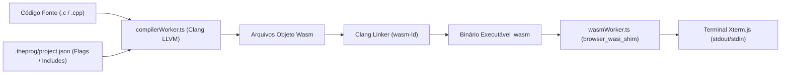
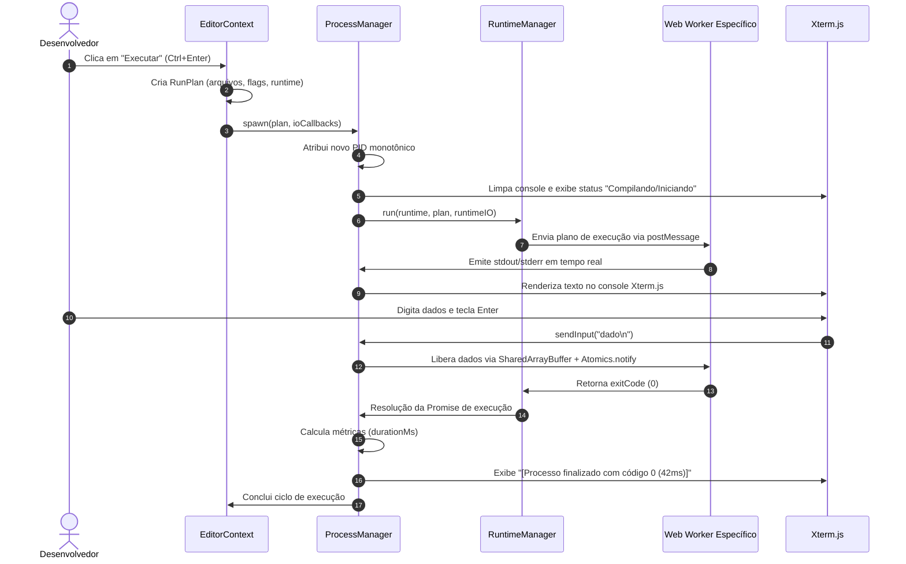

# ⚙️ 02_RUNTIMES_AND_EXECUTION.md — Motores de Execução, Compiladores e Processos

> **TheProg Editor — Documentação Técnica Canônica**  
> *Versão do Sistema: `v0.6.0`*

---

## 1. Visão Geral dos Ambientes de Execução

O **TheProg Editor** suporta cinco linguagens de programação de primeira classe organizadas em três subsistemas de runtime isolados:

| Linguagem | Motor / Compilador | Especificação de Execução | Isolamento | Formatação (`Shift+Alt+F`) |
| :--- | :--- | :--- | :--- | :--- |
| **C** | `@yowasp/clang` (LLVM 22) | WebAssembly WASI (`@bjorn3/browser_wasi_shim`) | Web Worker (`wasmWorker.ts`) | `@wasm-fmt/clang-format` |
| **C++** | `@yowasp/clang` (LLVM 22) | WebAssembly WASI (`@bjorn3/browser_wasi_shim`) | Web Worker (`wasmWorker.ts`) | `@wasm-fmt/clang-format` |
| **Python** | Pyodide 314 (CPython 3.12/3.14) | CPython Wasm nativo com `micropip` | Web Worker (`pythonWorker.ts`) | `black` via Pyodide |
| **JavaScript** | `esbuild-wasm` (bundler) | Motor V8 / JavaScriptCore com escopo higienizado | Web Worker (`jsWorker.ts`) | Monaco Formatter nativo |
| **TypeScript** | `esbuild-wasm` (transpiler) | Motor V8 / JavaScriptCore com escopo higienizado | Web Worker (`jsWorker.ts`) | Monaco Formatter nativo |

---

## 2. Subsistema C & C++ (YoWASP Clang + WASI)

### 2.1 Pipeline de Compilação (`compilerWorker.ts` & `cCompiler.ts`)
O compilador C/C++ roda dentro de [`compilerWorker.ts`](file:///src/workers/compilerWorker.ts). Ele encapsula a distribuição WebAssembly do **LLVM Clang** empacotada pelo projeto YoWASP.



1. **Compilação Multi-arquivo Declarativa:**
   - O sistema procura o arquivo [`.theprog/project.json`](file:///src/services/buildConfig.ts) na raiz do projeto.
   - Permite declarar pontos de entrada (`entry`), lista de arquivos (`sources`), diretórios de include (`includeDirs`) e flags adicionais do compilador (`flags`), como `-O2`, `-std=c++17`, `-Wall`:
     ```json
     {
       "entry": "src/main.cpp",
       "sources": ["src/main.cpp", "src/utils/math.cpp"],
       "includeDirs": ["include"],
       "flags": ["-Wall", "-O2", "-std=c++17"]
     }
     ```
2. **Resolução Automática sem Configuração:**
   - Se o `.theprog/project.json` não existir, o compilador detecta todos os arquivos `.c` ou `.cpp` do projeto e os compila e vincula automaticamente em um único binário final.
3. **Cache de Compilação Inteligente:**
   - Implementado em [`cCompiler.ts`](file:///src/services/cCompiler.ts). O compilador calcula um hash SHA-256 do conteúdo dos fontes e das flags. Se o código não tiver sido alterado desde a última execução, a etapa de compilação é ignorada instantaneamente (`cached: true`), pulando diretamente para o runner WASI.

### 2.2 Camada de Execução WASI (`wasmWorker.ts`)
- Binários WebAssembly compilados com a target `wasm32-wasi` requerem uma implementação da especificação **WASI (WebAssembly System Interface)**.
- O TheProg Editor utiliza `@bjorn3/browser_wasi_shim` configurado em [`wasmWorker.ts`](file:///src/workers/wasmWorker.ts).
- O shim intercepta chamadas de sistema como:
  - `fd_write` (1 e 2): repassa streams para `stdout` e `stderr`.
  - `fd_read` (0): sincroniza chamadas bloqueantes com o `SharedArrayBuffer` via `Atomics.wait`.
  - Chamadas de arquivos (`path_open`, `fd_write` em disco virtual): arquivos criados ou modificados pelo programa em C durante o runtime são capturados pelo listener [`fsSync.ts`](file:///src/workers/fsSync.ts) e propagados para a interface e para o disco local.

> [!CAUTION]
> **Preservação de Memória na Interrupção:**  
> A promessa de execução em `executeWasmBinary` resolve explicitamente com o código `130` (`SIGINT`) no manipulador de cancelamento antes de invocar `worker.terminate()`. Isso impede deadlocks assíncronos e vazamentos permanentes de closures na heap da UI thread.

---

## 3. Subsistema Python (CPython 3.12/3.14 via Pyodide)

### 3.1 Arquitetura do Worker Python (`pythonWorker.ts`)
O ambiente Python roda sobre o [Pyodide](https://pyodide.org/) isolado em [`pythonWorker.ts`](file:///src/workers/pythonWorker.ts).

1. **Entrada Interativa com Atomics:**
   - `input()` em Python é implementado nativamente pelo Pyodide usando a API `setStdin()` com função de leitura síncrona conectada ao `SharedArrayBuffer`.
2. **Buffer de Interrupção Assíncrona:**
   - Um `Uint8Array(1)` compartilhado é configurado com `pyodide.setInterruptBuffer()`.
   - Quando o usuário cancela a execução com `Ctrl+C` ou pelo botão Parar, a gravação de `2` no buffer injeta um `KeyboardInterrupt` imediato na VM do Python, cancelando loops sem a necessidade de descartar e reinstanciar o worker.
3. **Limpeza de `sys.modules` entre Execuções:**
   - Para evitar que módulos importados fiquem cacheados e não reflitam edições recentes do usuário, o worker realiza um snapshot dos módulos internos nativos na inicialização e expurga módulos criados pelo usuário antes de cada novo disparo.
4. **Gerenciamento Offline de Pacotes (`micropip`):**
   - Suporte a instalação de wheels puros via [`pythonPackages.ts`](file:///src/services/pythonPackages.ts).
   - As wheels baixadas são armazenadas em `.theprog/py-packages/` e persistidas no IndexedDB e no Service Worker, permitindo que bibliotecas como `numpy` (versão Wasm) ou módulos puros continuem utilizáveis mesmo sem conexão com a internet.

---

## 4. Subsistema JavaScript & TypeScript (esbuild + Sandbox)

### 4.1 Bundling de Módulos Locais (`bundlerWorker.ts`)
Diferente de simples avaliações de código com `eval()`, o TheProg Editor suporta projetos modulares em JS e TS com múltiplos arquivos e declarações `import` / `export`:
- O [`bundlerWorker.ts`](file:///src/workers/bundlerWorker.ts) roda o motor `esbuild-wasm`.
- Implementa um plugin de resolução virtual de namespace (`theprog-workspace`) que intercepta caminhos relativos (ex.: `import { soma } from './math.ts'`) e injeta os arquivos diretamente da memória do editor.
- O bundle final resultante é um script único no formato IIFE com source maps funcionais.

### 4.2 Execução com Sandbox Higienizado (`jsWorker.ts`)
Para impedir que códigos de usuário acessem credenciais, dados salvos no IndexedDB de outros workspaces ou façam requisições arbitrárias, o worker [`jsWorker.ts`](file:///src/workers/jsWorker.ts) executa a rotina `sanitizeGlobalScope()` antes de rodar o código:
```typescript
// Revogação de superfícies perigosas do navegador
const forbiddenGlobals = [
  'indexedDB', 'caches', 'fetch', 'XMLHttpRequest',
  'WebSocket', 'Worker', 'SharedWorker', 'BroadcastChannel'
];
for (const key of forbiddenGlobals) {
  try {
    Object.defineProperty(self, key, {
      get() { throw new Error(`Acesso à API '${key}' é estritamente bloqueado na sandbox.`); },
      configurable: false,
    });
  } catch {}
}
```

---

## 5. Orquestração com o `ProcessManager`

O controle de execução de qualquer linguagem é padronizado pelo [`ProcessManager`](file:///src/services/process/processManager.ts):

### 5.1 Estrutura do `ProcessDescriptor`
```typescript
export interface ProcessDescriptor {
  pid: number;                         // Identificador monotônico estrito
  runtime: RuntimeId;                  // 'clang' | 'python' | 'js'
  entryFile: string;                   // Caminho do arquivo executado
  status: ProcessStatus;               // 'idle' | 'spawning' | 'running' | 'stopping' | 'terminated'
  stdinQueue: string[];                // Fila FIFO de linhas de entrada
  isAwaitingInput: boolean;            // Flag indicando espera de stdin
  inputBuffer: string;                 // Buffer de linha sendo editada
  controller: StdinController | null;  // Controlador do SAB e cancelamento
  startTime: number;                   // Timestamp de início (performance.now())
  endTime?: number;                    // Timestamp de término
  exitCode?: number;                   // Código de retorno (0 = sucesso, 130 = SIGINT)
  cached?: boolean;                    // Indica se usou binário em cache
  metrics?: ProcessMetrics;            // Duração em ms e telemetria
}
```

### 5.2 Fluxo Completo de Execução


---

## 6. Mapeamento de Arquivos do Subsistema

- Compilador C/C++: [`src/services/cCompiler.ts`](file:///src/services/cCompiler.ts)
- Worker YoWASP Clang: [`src/workers/compilerWorker.ts`](file:///src/workers/compilerWorker.ts)
- Worker Runner WASI: [`src/workers/wasmWorker.ts`](file:///src/workers/wasmWorker.ts)
- Runtime Adapter Clang: [`src/services/runtimes/clangRuntime.ts`](file:///src/services/runtimes/clangRuntime.ts)
- Worker Python: [`src/workers/pythonWorker.ts`](file:///src/workers/pythonWorker.ts)
- Runtime Adapter Python: [`src/services/runtimes/pythonRuntime.ts`](file:///src/services/runtimes/pythonRuntime.ts)
- Worker Bundler esbuild: [`src/workers/bundlerWorker.ts`](file:///src/workers/bundlerWorker.ts)
- Worker Sandbox JS: [`src/workers/jsWorker.ts`](file:///src/workers/jsWorker.ts)
- Runtime Adapter JS: [`src/services/runtimes/jsRuntime.ts`](file:///src/services/runtimes/jsRuntime.ts)
- Orquestrador de Processos: [`src/services/process/processManager.ts`](file:///src/services/process/processManager.ts)
