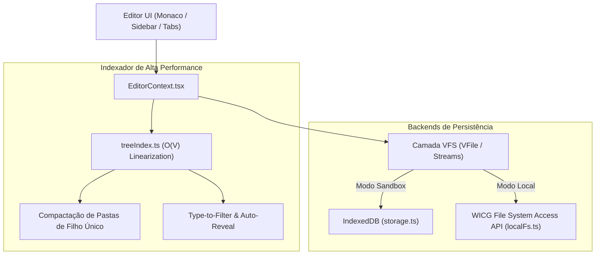

# 💾 03_STORAGE_AND_VFS.md — Armazenamento Dual, Virtual File System e Árvore Linear

> **TheProg Editor — Documentação Técnica Canônica**  
> *Versão do Sistema: `v0.6.0`*

---

## 1. Visão Geral da Camada de Armazenamento

O **TheProg Editor** opera sobre um modelo de persistência dual unificado por uma abstração de **Virtual File System (VFS)**. Isso permite que a mesma interface do editor interaja de forma transparente com dois tipos de backend:

1. **Modo Sandbox Virtual (IndexedDB):** Espaço autocontido dentro do navegador, isolado por domínio e independente do sistema de arquivos do computador hospedeiro.
2. **Modo Disco Local (WICG File System Access API):** Edição direta de pastas reais no computador do usuário (Chrome, Edge, Opera), com persistência imediata no sistema de arquivos nativo.



---

## 2. Abstração de Virtual File System ([`VFile`](file:///src/services/vfs/vfs.ts))

O VFS padroniza como o editor, os compiladores e os trabalhadores manipulam dados, resolvendo inconsistências históricas de conversão de tipos:

```typescript
export interface VFile {
  id: string;
  path: string;
  name: string;
  kind: FileKind;              // 'text' | 'binary' | 'image' | 'too_large'
  size: number;
  updatedAt: number;
  readBytes(): Promise<Uint8Array>;
  readText(): Promise<string>;
  readStream(chunkSize?: number): ReadableStream<Uint8Array>;
  write(data: Uint8Array | string): Promise<void>;
}
```

### 2.1 Classificação Estrita de Arquivos (`FileKind`)
- `'text'`: Arquivos de código-fonte, scripts, JSON e textos planos legíveis pelo Monaco.
- `'binary'`: Binários compilados (`.wasm`), bancos de dados SQLite (`.sqlite`), compactados (`.zip`, `.tar`) e arquivos brutos. Manipulados estritamente como `Uint8Array`.
- `'image'`: Imagens (`.png`, `.jpg`, `.jpeg`, `.svg`, `.gif`, `.webp`) exibidas pelo componente [`ImagePreview.tsx`](file:///src/components/common/ImagePreview.tsx).
- `'too_large'`: Arquivos com tamanho superior a $5\text{ MB}$ no disco local.

### 2.2 Salvaguarda Crítica: Proteção contra Destruição de Arquivos $> 5\text{ MB}$
Em versões legadas, arquivos grandes recebiam uma string placeholder inline. Ao salvar com auto-save (`Ctrl+S`), o placeholder sobrescrevia o arquivo real no disco, truncando megabytes de dados para uma única linha.

**Implementação da Proteção Atual:**
1. Em [`localFs.ts`](file:///src/services/localFs.ts), qualquer arquivo com `size > 5 * 1024 * 1024` recebe obrigatoriamente `kind: 'too_large'`.
2. O Monaco Editor bloqueia a edição com `readOnly: true`.
3. Em [`EditorContext.tsx`](file:///src/context/EditorContext.tsx), as rotinas `saveActiveFile` e `autoSave` realizam validação precoce:
   ```typescript
   if (activeFile.kind === 'too_large') {
     console.warn('Gravação abortada: arquivo marcado como too_large.');
     return;
   }
   ```
4. A tela de visualização exibe o componente de segurança [`UnsupportedFileView.tsx`](file:///src/components/common/UnsupportedFileView.tsx) com botão para download direto do arquivo intacto.

### 2.3 Preservação de Integridade de Binários
Binários gerados em tempo de execução (como um programa C que gera uma imagem ou processa áudio) são transmitidos via `Uint8Array` pelo evento `fs_sync`. O editor nunca aplica `TextDecoder` sobre arquivos marcados como binários, prevenindo substituição irreversível de bytes inválidos por `\uFFFD`.

---

## 3. Modo Sandbox: IndexedDB ([`storage.ts`](file:///src/services/storage.ts))

O banco de dados do navegador `theprog-editor-db` está na **versão 4**, estruturado nas seguintes *object stores*:

| Object Store | Chave Primária (`keyPath`) | Índices Secundários | Descrição dos Dados |
| :--- | :--- | :--- | :--- |
| **`files`** | `id` | `parentId`, `path` (único) | Arquivos e pastas do workspace virtual (`FileItem`). |
| **`settings`** | Chave manual (`'user_settings'`) | — | Preferências de usuário (`UserSettings`). |
| **`recent_workspaces`** | `id` | — | Histórico de projetos abertos recentemente. |
| **`runtime_assets`** | Chave manual (URL ou nome) | — | Wheels Python e binários cacheados. |
| **`git_fs`** | Chave textual (caminho relativo) | — | Árvore de objetos, refs e commits do Git local. |
| **`vmCache`** | Chave manual | — | Metadados de cache de execução. |

### 3.1 Gestão de Concorrência Multi-Aba no IndexedDB
Para evitar deadlocks ou travamento de dados caso o usuário abra múltiplas abas da IDE simultaneamente, a inicialização com `idb` implementa listeners formais de governança:
- `blocked()`: Emite aviso no console caso outra aba esteja impedindo a migração de esquema.
- `blocking()`: Fecha a conexão do banco de dados imediatamente para permitir que outra aba realize o upgrade.
- `terminated()`: Captura quedas abruptas de conexão do navegador e reinicializa a promessa de conexão (`dbPromise = null`).

---

## 4. Modo Disco Local: WICG File System Access API ([`localFs.ts`](file:///src/services/localFs.ts))

Permite aos usuários selecionar uma pasta do disco rígido e trabalhar diretamente sobre os arquivos locais.

### 4.1 Tipagem Estrita e Zero `as any` ([`src/types/filesystem.d.ts`](file:///src/types/filesystem.d.ts))
Todas as interfaces da especificação WICG estão formalmente declaradas no repositório:
- `window.showDirectoryPicker()`
- `FileSystemHandle.move(destinationDirectory, newName)`
- `FileSystemWritableFileStream.write(BufferSource)`
- `FileSystemDirectoryHandle.values()`

### 4.2 Prevenção de Loops com `recordInternalWrite`
Quando o editor grava alterações em um arquivo no disco local, o sistema de monitoramento de arquivos (*polling* / eventos do SO) pode detectar a alteração e tentar recarregar o arquivo do disco para o editor, gerando um loop de escrita e sincronização infinita.
- O serviço [`localFs.ts`](file:///src/services/localFs.ts) mantém o registro dos arquivos gravados pela própria aplicação via `recordInternalWrite(path)`.
- Quando a rotina de scan `syncLocalDirectory` roda, ela checa `isInternalWrite(path)`. Se o evento foi disparado pelo próprio editor nos últimos 1.500 ms, a recarga externa é ignorada.

---

## 5. File Explorer 2.0: Indexador de Alta Performance ([`treeIndex.ts`](file:///src/services/fileTree/treeIndex.ts))

O explorador de arquivos foi totalmente reengenheirado para garantir que a renderização da árvore permaneça instantânea mesmo com centenas de arquivos:

### 5.1 Linearização e Indexação em Tempo Linear $O(V)$
- Em vez de realizar recursão profunda com `.filter()` e `.sort()` a cada ciclo de renderização do React, a função `buildDirectoryIndex(files)` gera um índice plano memoizado indexado por `parentId`.
- A função `getVisibleLinearNodes(...)` percorre exclusivamente os nós que estão em pastas abertas (`expandedFolders`), retornando uma lista plana de nós com profundidade virtual calculada (`depth`).
- Isso reduz o custo de reconciliação do React DOM de $O(N \cdot D)$ para $O(V)$, onde $V$ é estritamente a contagem de nós visíveis na tela.

### 5.2 Compactação de Pastas de Filho Único (*Compact Folders*)
Inspirado nos editores modernos de desktop (como VS Code):
- Se uma pasta contém exatamente um único filho e esse filho também é uma pasta (ex.: `src` contendo apenas `components`, que contém apenas `layout`), o indexador condensa essa cadeia em uma única linha: `src/components/layout`.
- Reduz a poluição vertical e economiza cliques do desenvolvedor.
- O recurso pode ser ativado ou desativado nas Configurações (`compactFolders: boolean`).

### 5.3 Criação Rápida de Caminhos Aninhados ([`pathUtils.ts`](file:///src/services/fileTree/pathUtils.ts))
O usuário pode clicar em "Novo Arquivo" na raiz e digitar diretamente:
```text
src/controllers/auth/login.ts
```
O sistema:
1. Normaliza os segmentos de caminho.
2. Identifica quais pastas intermediárias já existem.
3. Cria sequencialmente as pastas faltantes (`src`, `controllers`, `auth`).
4. Cria o arquivo de destino `login.ts`.
5. Adiciona todos os IDs de pastas geradas a `expandedFolders` para exibir o arquivo aberto imediatamente.

---

## 6. Mapeamento de Arquivos do Subsistema

- Camada VFS Unificada: [`src/services/vfs/vfs.ts`](file:///src/services/vfs/vfs.ts)
- Persistência IndexedDB: [`src/services/storage.ts`](file:///src/services/storage.ts)
- Integração Disco Local (WICG): [`src/services/localFs.ts`](file:///src/services/localFs.ts)
- Declaração de Tipos WICG: [`src/types/filesystem.d.ts`](file:///src/types/filesystem.d.ts)
- Indexador de Árvore e Linearização: [`src/services/fileTree/treeIndex.ts`](file:///src/services/fileTree/treeIndex.ts)
- Utilitários de Caminho e Aninhamento: [`src/services/fileTree/pathUtils.ts`](file:///src/services/fileTree/pathUtils.ts)
- Componente da Barra Lateral: [`src/components/layout/Sidebar.tsx`](file:///src/components/layout/Sidebar.tsx)
