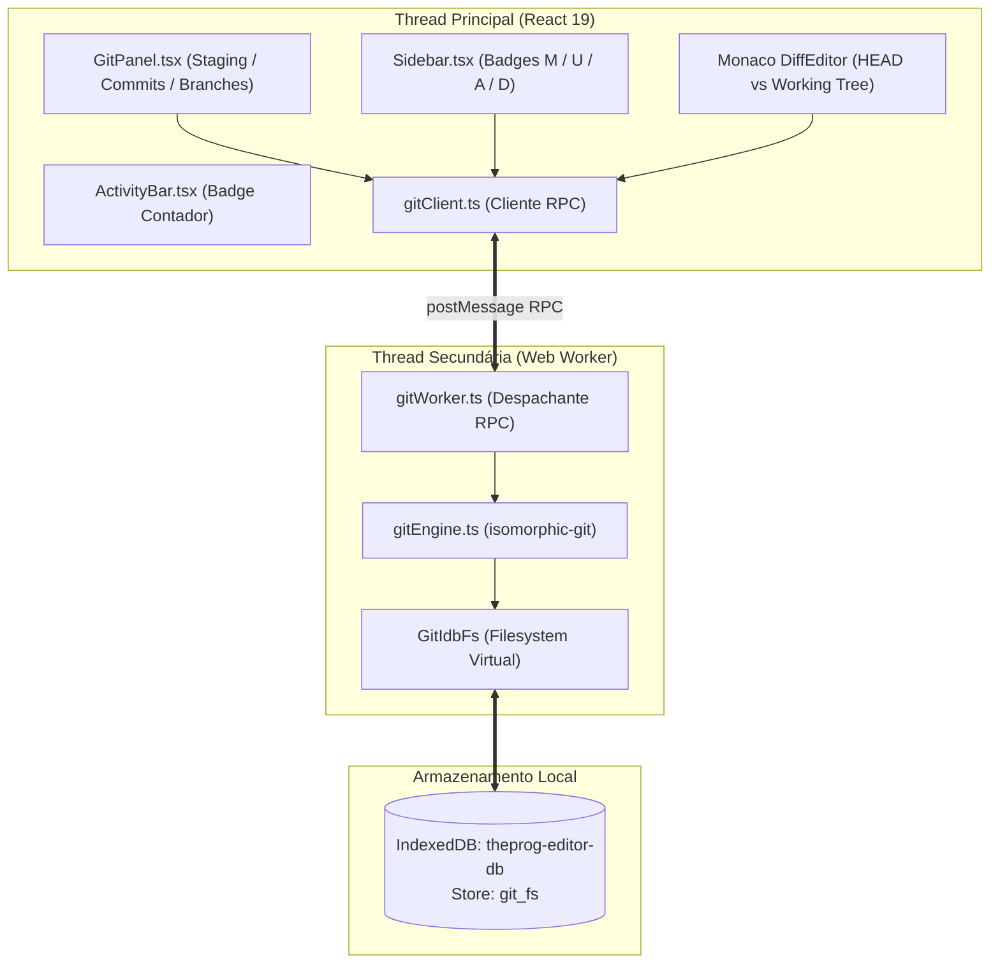

# 🌿 04_GIT_SUBSYSTEM.md — Controle de Versão Git Client-Side no Navegador

> **TheProg Editor — Documentação Técnica Canônica**  
> *Versão do Sistema: `v0.6.0`*

---

## 1. Visão Geral do Subsistema Git

O **TheProg Editor** conta com um motor completo de controle de versão Git operando de forma **100% autônoma, offline e client-side**, sem qualquer necessidade do binário `git` instalado no sistema operacional ou de um servidor remoto de apoio.

O subsistema permite inicializar repositórios, gerenciar branches, realizar staging granular de arquivos, registrar commits com histórico criptográfico SHA-1 e comparar modificações lado a lado no **Monaco DiffEditor**.

---

## 2. Arquitetura e Componentes-Chave

### 2.1 Isolamento em Web Worker ([`gitWorker.ts`](file:///src/workers/gitWorker.ts))
Operações do Git envolvem compressão zlib (formato *loose object*), cálculo repetido de hashes SHA-1 e travessia de árvores de diretórios. Executar essas operações na thread principal causaria engasgos perceptíveis na digitação do Monaco Editor.
- Toda a lógica do `isomorphic-git` reside isolada em [`gitWorker.ts`](file:///src/workers/gitWorker.ts).
- A UI thread se comunica através de um cliente RPC assíncrono baseado em promessas ([`gitClient.ts`](file:///src/services/git/gitClient.ts)).

### 2.2 Camada de Persistência Virtual: [`GitIdbFs`](file:///src/services/git/gitEngine.ts)
Diferente de protótipos em memória volátil (cujo histórico se perde ao pressionar F5), o TheProg Editor implementa um adaptador de sistema de arquivos compatível com a especificação do `isomorphic-git` persistido no **IndexedDB**:
- Armazenado na object store **`git_fs`** do banco `theprog-editor-db` (v4).
- Mantém em cache local de memória (`Map<string, Uint8Array>`) a estrutura do repositório para acesso instantâneo.
- Todas as mutações (`writeFile`, `unlink`, `mkdir`, `rmdir`) gravam assincronamente no IndexedDB, garantindo que branches, histórico de commits e a pasta `.git` completa sobrevivam a reinicializações da página e fechamentos de navegador.

---

## 3. Fluxo de Trabalho e Operações Suportadas

O painel [`GitPanel.tsx`](file:///src/components/layout/GitPanel.tsx) na barra lateral fornece uma interface intuitiva inspirada no VS Code:

### 3.1 Inicialização do Repositório (`git init`)
- Caso o workspace ainda não seja um repositório Git, o painel exibe um botão de boas-vindas para "Inicializar Repositório".
- Cria as referências padrão `.git/HEAD` apontando para `refs/heads/main` e a estrutura de configuração inicial.

### 3.2 Sincronização do Working Tree e Cálculo de Status
- O método `gitClient.sync(files)` sincroniza os arquivos ativos da IDE com a árvore de trabalho do Git.
- `gitClient.status()` retorna uma lista de [`GitStatusEntry`](file:///src/types/editor.ts), classificando cada arquivo em:
  - `status`: `'modified'`, `'added'`, `'deleted'`, `'unmodified'`.
  - `stage`: `'staged'`, `'unstaged'`, `'untracked'`.
- Os arquivos modificados recebem badges visuais coloridas no explorador de arquivos:
  - **M** (*Modified*)
  - **U** / **A** (*Untracked / Added*)
  - **D** (*Deleted*)

### 3.3 Área de Staging e Descarte
- **Stage Individual:** Botão `+` ao lado de cada arquivo move o item para a seção *Staged Changes* (`git.add()`).
- **Unstage Individual:** Botão `-` retira o arquivo da área de preparação sem alterar o conteúdo da árvore de trabalho (`git.resetIndex()`).
- **Stage All / Unstage All:** Ações rápidas no cabeçalho da seção.
- **Descarte de Alterações (*Discard Changes*):** Botão de reversão que restaura o conteúdo do arquivo para a versão exata do último commit (`HEAD`), acompanhado de um diálogo de confirmação do sistema para evitar perda acidental de código.

### 3.4 Formulário de Commit e Histórico
- Caixa de mensagem de commit com suporte ao atalho `Ctrl+Enter` para submissão rápida.
- Campos opcionais para configuração de Nome e E-mail do autor (persistidos em `localStorage`).
- Listagem dos últimos commits (`git log`) com hash SHA resumido (7 caracteres), mensagem, data/hora relativa e autor.

### 3.5 Alternância e Criação de Branches
- Seletor de branch no cabeçalho do `GitPanel`.
- Permite alternar (*checkout*) instantaneamente entre ramos locais ou criar uma nova branch a partir do estado atual da `HEAD`.

### 3.6 Comparação Visual de Diffs (Monaco DiffEditor)
Ao clicar em qualquer arquivo listado em *Changes* ou *Staged Changes*:
1. O editor abre uma aba especial marcada como `isDiff: true`.
2. O `gitWorker` extrai o conteúdo do arquivo no commit `HEAD` via `gitEngine.getFileAtHead(filepath)`.
3. O componente [`EditorArea.tsx`](file:///src/components/layout/EditorArea.tsx) renderiza o `<DiffEditor />` nativo do Monaco, destacando linhas inseridas em verde e linhas removidas em vermelho com navegação de diferenças.

---

## 4. Limitações Inerentes do Navegador & Roadmap Remoto

A operação 100% client-side impõe restrições técnicas fundamentais decorrentes do modelo de segurança dos navegadores:

### 4.1 Desafios para Operações Remotas (`clone`, `pull`, `push`)

| Desafio | Causa Técnica | Solução Arquitetural Projetada |
| :--- | :--- | :--- |
| **Ausência de Sockets TCP/SSH** | Navegadores web não possuem acesso a sockets de rede brutos para a porta 22 (SSH) ou 9418 (Git nativo). | Utilização exclusiva do protocolo HTTPS (*Smart HTTP Git Transfer Protocol*). |
| **Bloqueio de CORS** | Servidores como GitHub e GitLab não emitem cabeçalhos `Access-Control-Allow-Origin: *` em seus endpoints de clone/push. | Proxy CORS stateless de borda (Cloudflare Worker) que apenas repassa os streams HTTP com os devidos cabeçalhos autorizados. |
| **Cabeçalho COEP da IDE** | A IDE roda com `Cross-Origin-Embedder-Policy: require-corp` para ativar o `SharedArrayBuffer`. Qualquer requisição externa sem `CORP: cross-origin` é sumariamente bloqueada pelo navegador. | O proxy CORS adiciona obrigatoriamente `Cross-Origin-Resource-Policy: cross-origin` em todas as respostas de packfiles. |

### 4.2 Próximas Fases Planejadas
Conforme detalhado no estudo arquitetural [`ESTUDO_E_TODO_GIT.md`](file:///ESTUDO_E_TODO_GIT.md):
- **Fase 3.1:** Deploy de Worker Cloudflare público para proxy CORS seguro e stateless.
- **Fase 3.2:** Modal de autenticação segura para inserção e retenção temporária de *Personal Access Token* (PAT do GitHub/GitLab).
- **Fase 3.3:** Comandos de sincronização remota: `git clone` (com clonagem rasa `depth: 1` para download rápido de packfiles), `git pull` e `git push`.

---

## 5. Governança e Feature Flag

Por se tratar de um subsistema de alta sofisticação técnica, o Git está protegido por uma **feature flag**:
- Chave em `UserSettings`: `enableGitExperimental: boolean` (desativada por padrão).
- Pode ser ativada a qualquer momento em: **Configurações (`Ctrl+,`) > Geral & Editor > Ativar controle de versão Git (experimental)**.
- Quando desativada, o botão de ramo na `ActivityBar` fica oculto e os workers de Git não são instanciados, preservando memória.

---

## 6. Mapeamento de Arquivos do Subsistema

- Motor e Filesystem IndexedDB: [`src/services/git/gitEngine.ts`](file:///src/services/git/gitEngine.ts)
- Web Worker do Git: [`src/workers/gitWorker.ts`](file:///src/workers/gitWorker.ts)
- Cliente e Fachada RPC: [`src/services/git/gitClient.ts`](file:///src/services/git/gitClient.ts)
- Interface Lateral do Git: [`src/components/layout/GitPanel.tsx`](file:///src/components/layout/GitPanel.tsx)
- Barra de Atividades com Contador: [`src/components/layout/ActivityBar.tsx`](file:///src/components/layout/ActivityBar.tsx)
- Testes Unitários do Git: [`src/services/git/gitClient.test.ts`](file:///src/services/git/gitClient.test.ts)
- Estudo Completo de Viabilidade: [`ESTUDO_E_TODO_GIT.md`](file:///ESTUDO_E_TODO_GIT.md)
