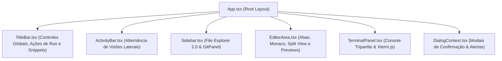

# 🖥️ 05_UI_AND_COMPONENTS.md — Engenharia de Interface, Monaco Editor e Xterm.js

> **TheProg Editor — Documentação Técnica Canônica**  
> *Versão do Sistema: `v0.6.0`*

---

## 1. Visão Geral da Interface e Tecnologias

A interface do **TheProg Editor** é construída com **React 19**, **TypeScript** e **Tailwind CSS v4**, projetada para reproduzir a ergonomia e os padrões de usabilidade de editores desktop modernos (como o VS Code), operando inteiramente em uma janela de navegador ou janela autônoma de PWA.



---

## 2. Camadas do Shell da Aplicação

### 2.1 Barra de Título ([`TitleBar.tsx`](file:///src/components/layout/TitleBar.tsx))
- **Nome do Projeto & Espaço de Trabalho:** Exibe o nome do workspace ativo (com ícone indicando Sandbox IDB ou Pasta Local do Disco). Permite alternar de projeto com um clique.
- **Botões de Ação de Execução:**
  - Botão **"Executar"** (`Ctrl+Enter`): compila e executa o arquivo aberto ou o projeto ativo. Exibe spinner e porcentagem de download durante a inicialização do runtime.
  - Botão **"Parar"** (`Ctrl+C`): interrompe instantaneamente o processo ativo via [`ProcessManager.terminate()`](file:///src/services/process/processManager.ts).
- **Catálogo Didático:** Botão para abrir o modal de snippets com algoritmos prontos.
- **Configurações & Ajuda:** Acesso rápido às preferências e lista de atalhos.

### 2.2 Barra de Atividades ([`ActivityBar.tsx`](file:///src/components/layout/ActivityBar.tsx))
- Barra vertical esquerda ultrafina permitindo alternar o painel da Sidebar entre:
  - **Explorador de Arquivos (`Files`):** árvore de arquivos do projeto.
  - **Controle de Versão Git (`GitBranch`):** visível quando a flag experimental estiver ativa, com badge numérico em tempo real indicando alterações pendentes.
  - **Configurações (`Settings`):** atalho inferior para abrir o modal de preferências.

### 2.3 Barra Lateral ([`Sidebar.tsx`](file:///src/components/layout/Sidebar.tsx))
- **Criação de Arquivos e Pastas:** Suporte a caminhos aninhados (`src/utils/math.c`).
- **Compactação de Pastas (*Folder Compaction*):** Une pastas de filho único em uma linha contínua.
- **Filtro Instantâneo (*Type-to-Filter*):** Campo de busca rápida com atalho `Ctrl+F` e destaque com `<mark>`.
- **Drag & Drop Completo:** Movimentação interna de itens e suporte a arrastar arquivos e pastas do sistema operacional (Explorer / Finder) diretamente para a árvore do editor.
- **Navegação por Teclado e Acessibilidade (WAI-ARIA):** `role="tree"` com suporte a setas direcionais, `Enter` para abrir, `F2` para renomear e `Delete` para excluir.
- **Auto-Reveal:** Ao alternar de arquivo no editor, a árvore abre as pastas ancestrais e faz rolagem suave até o item.

---

## 3. Área de Edição ([`EditorArea.tsx`](file:///src/components/layout/EditorArea.tsx))

A área central de edição hospeda o sistema de abas e os diferentes motores de visualização:

### 3.1 Sistema de Abas e Modo Preview
Inspirado na gestão de abas do VS Code para evitar proliferação desordenada de arquivos abertos:
- **Modo Preview (Clique Simples):**
  - O arquivo abre com o título da aba em **itálico**.
  - Se o desenvolvedor clicar em outro arquivo no explorador, a mesma aba é reutilizada para exibir o novo arquivo.
- **Fixação Permanente (*Pin Tab*):**
  - Ocorre automaticamente se o usuário der um **duplo clique** na aba ou no arquivo no explorador, ou se **editar qualquer caractere** no arquivo.
  - A fonte volta ao padrão reto e a aba não é mais sobrescrita por novos cliques.
- **Indicador Dirty (`*`):**
  - Quando um arquivo possui edições não salvas no disco, uma bolinha circular ou asterisco é exibido ao lado do botão de fechar.
  - O fechamento de abas dirty solicita diálogo de confirmação.

### 3.2 Modo Dividido (Split View)
- Permite dividir a área de código horizontalmente ou verticalmente.
- O desenvolvedor pode inspecionar uma implementação em C e seu respectivo cabeçalho `.h` lado a lado, com sincronização em tempo real e buffers de digitação independentes.

### 3.3 Visualizadores Especializados de Conteúdo
O editor identifica o tipo do arquivo através de `FileKind` e carrega o componente ideal:
1. **Código-Fonte (Monaco Editor):** `@monaco-editor/react` com syntax highlighting, IntelliSense, validação estática de TypeScript, resolução de `#include` e formatador.
2. **Comparação Git (Monaco DiffEditor):** Exibe o arquivo no commit `HEAD` à esquerda e as modificações atuais da árvore de trabalho à direita, com navegação de linhas alteradas.
3. **Documentação ([`MarkdownPreview.tsx`](file:///src/components/common/MarkdownPreview.tsx)):** Renderizador nativo de Markdown com suporte a fórmulas KaTeX, blocos de código com destaque e sanitização contra scripts maliciosos.
4. **Imagens ([`ImagePreview.tsx`](file:///src/components/common/ImagePreview.tsx)):** Visualizador de `.png`, `.jpg`, `.jpeg`, `.svg`, `.gif` e `.webp` com dimensões em pixels e tamanho em bytes.
5. **Arquivos Binários ([`UnsupportedFileView.tsx`](file:///src/components/common/UnsupportedFileView.tsx)):** Tela de proteção para arquivos binários desconhecidos ou arquivos $> 5\text{ MB}$ (`kind: 'too_large'`), prevenindo que o Monaco renderize texto corrompido e permitindo o download direto do binário íntegro.

---

## 4. Console Tripartite ([`TerminalPanel.tsx`](file:///src/components/layout/TerminalPanel.tsx))

O painel inferior organiza a comunicação com o desenvolvedor em três abas especializadas:

```text
┌────────────────────────────────────────────────────────────────────────┐
│ [Ambiente] │ [Execução (Xterm.js)] │ [Testes & Casos (OBI)]            │
├────────────────────────────────────────────────────────────────────────┤
│ (Terminal interativo com suporte ANSI, links clicáveis e ajuste Fit)   │
└────────────────────────────────────────────────────────────────────────┘
```

1. **Aba "Ambiente":**
   - Logs de inicialização de WebAssembly, download de compiladores com barra percentual, diagnósticos de compilação do Clang e mensagens do sistema.
2. **Aba "Execução":**
   - Terminal interativo [Xterm.js](https://xtermjs.org/) completo (`@xterm/xterm` v6).
   - Equipado com `FitAddon` (ajuste dinâmico ao redimensionar a janela) e `WebLinksAddon` (links HTTP clicáveis).
   - Suporte completo a sequências de escape ANSI para cores e estilos de texto.
   - Sincronizado diretamente com a fila FIFO do [`ProcessManager`](file:///src/services/process/processManager.ts).
3. **Aba "Testes & Casos":**
   - Painel integrado ([`TestRunnerPanel.tsx`](file:///src/components/layout/TestRunnerPanel.tsx)) voltado para resolução de problemas de olimpíadas de informática (OBI), Beecrowd e LeetCode.
   - Cadastro de múltiplos pares de entrada/saída com vereditos automáticos (Accepted, Wrong Answer com diff inline, Time Limit Exceeded e Runtime Error).

---

## 5. Gerenciamento de Estado Global ([`EditorContext.tsx`](file:///src/context/EditorContext.tsx))

O [`EditorContext.tsx`](file:///src/context/EditorContext.tsx) é o hub central de estado reativo da aplicação:
- Mantém o array de arquivos em memória (`files: FileItem[]`).
- Controla abas abertas (`tabs: EditorTab[]`) e o arquivo ativo (`activeFileId`).
- Gerencia o workspace ativo (`activeWorkspace: ActiveWorkspace`).
- Conecta ações de salvar, renomear, mover e deletar com os backends ([`storage.ts`](file:///src/services/storage.ts) e [`localFs.ts`](file:///src/services/localFs.ts)).
- Intermedia a execução através do [`processManager`](file:///src/services/process/processManager.ts).

### 5.1 Boas Práticas de Performance (React 19 & React Compiler)
Para evitar lentidão e alertas de renderização:
- **Desacoplamento de I/O:** O streaming de saída de texto do terminal **não** passa pelo estado do React; o Xterm.js se inscreve diretamente em eventos (`subscribeExecutionOutput`).
- **Sem Efeitos Síncronos em Efeito:** Evitar `setState` síncrono dentro de `useEffect` (conforme diagnosticado na regra `react(set-state-in-effect)`). Estados dependentes devem ser derivados durante o render ou atualizados pelo evento originador.
- **Memoização de Cálculos Pesados:** A lista de nós visíveis no explorador é calculada com `useMemo` sobre `directoryIndex` e `expandedFolders`.

---

## 6. Mapeamento de Arquivos do Subsistema

- Shell e Layout Principal: [`src/App.tsx`](file:///src/App.tsx)
- Contexto Central do Editor: [`src/context/EditorContext.tsx`](file:///src/context/EditorContext.tsx)
- Contexto de Tema: [`src/context/ThemeContext.tsx`](file:///src/context/ThemeContext.tsx)
- Contexto de Diálogos Modais: [`src/context/DialogContext.tsx`](file:///src/context/DialogContext.tsx)
- Barra de Título: [`src/components/layout/TitleBar.tsx`](file:///src/components/layout/TitleBar.tsx)
- Barra de Atividades: [`src/components/layout/ActivityBar.tsx`](file:///src/components/layout/ActivityBar.tsx)
- Barra Lateral: [`src/components/layout/Sidebar.tsx`](file:///src/components/layout/Sidebar.tsx)
- Área de Edição e Abas: [`src/components/layout/EditorArea.tsx`](file:///src/components/layout/EditorArea.tsx)
- Painel de Terminais: [`src/components/layout/TerminalPanel.tsx`](file:///src/components/layout/TerminalPanel.tsx)
- Runner de Testes Didáticos: [`src/components/layout/TestRunnerPanel.tsx`](file:///src/components/layout/TestRunnerPanel.tsx)
- Modais do Sistema: [`src/components/modals/`](file:///src/components/modals/)
