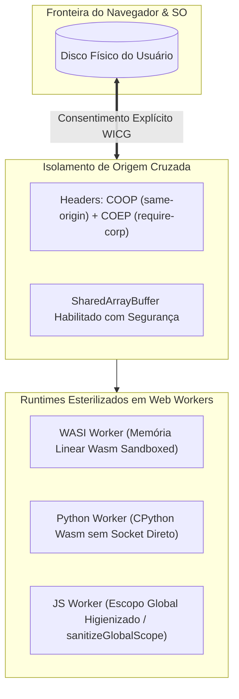

# 🔒 06_SECURITY_AND_SANDBOXING.md — Segurança, Defesa em Profundidade e Sandboxing

> **TheProg Editor — Documentação Técnica Canônica**  
> *Versão do Sistema: `v0.6.0`*

---

## 1. Filosofia de Segurança e Modelo de Ameaças

O **TheProg Editor** é construído sob o princípio de **privacidade absoluta por design (*Privacy by Design*)**.

Por não possuir nenhum servidor backend, o editor opera em um modelo no qual **nenhum código de usuário, token, commit ou arquivo de disco é enviado para servidores externos**. Todos os dados pertencem exclusivamente à máquina do desenvolvedor.

No entanto, como uma IDE web permite escrever e executar código arbitrário (incluindo código de terceiros ou bibliotecas não confiáveis), o sistema implementa **múltiplas camadas de isolamento e sandboxing**:



---

## 2. Isolamento de Origem Cruzada (COOP & COEP)

Para viabilizar `SharedArrayBuffer` e chamadas bloqueantes de terminal sem expor o usuário a ataques de canal lateral baseados em tempo (*Spectre / Meltdown*), o navegador exige **isolamento de processo de origem cruzada**:

### 2.1 Cabeçalhos Obrigatórios
Todas as respostas HTTP — tanto do servidor Vite de desenvolvimento, quanto do Service Worker em modo offline e da CDN Cloudflare em produção — emitem:

```http
Cross-Origin-Opener-Policy: same-origin
Cross-Origin-Embedder-Policy: require-corp
Cross-Origin-Resource-Policy: cross-origin
```

- **`COOP: same-origin`:** Garante que a janela da IDE execute em seu próprio contexto de navegação dedicado, impossibilitando que janelas abertas por scripts de terceiros obtenham referências ao DOM da aplicação.
- **`COEP: require-corp`:** Bloqueia o carregamento de quaisquer sub-recursos (imagens, scripts, fontes, workers) que não emitam explicitamente uma política de recursos de origem cruzada autorizada (`CORP`).
- **`CORP: cross-origin`:** Permite que recursos estáticos e wheels de runtimes sejam consumidos com segurança pelos workers isolados.

---

## 3. Sandboxing de Execução JavaScript/TypeScript (`jsWorker.ts`)

### 3.1 O Vetor de Ataque Mitigado
Se um desenvolvedor abrir um projeto de terceiros contendo scripts em JavaScript ou TypeScript maliciosos e clicar em "Executar", o script rodaria dentro do contexto de origem do TheProg Editor. Um script hostil poderia:
- Abrir o `indexedDB` da IDE e roubar códigos de outros projetos salvos no modo Sandbox.
- Fazer chamadas `fetch()` para exfiltrar códigos confidenciais para servidores remotos de atacantes.
- Instanciar Service Workers maliciosos ou abrir WebSockets furtivos.

### 3.2 Higienização de Escopo Global ([`sanitizeGlobalScope`](file:///src/workers/jsWorker.ts))
Para neutralizar esse risco, [`jsWorker.ts`](file:///src/workers/jsWorker.ts) roda uma rotina rigorosa de higienização de escopo antes de qualquer execução de código de usuário:

```typescript
export function sanitizeGlobalScope(): void {
  const forbiddenGlobals = [
    'indexedDB',
    'caches',
    'fetch',
    'XMLHttpRequest',
    'WebSocket',
    'Worker',
    'SharedWorker',
    'BroadcastChannel',
  ];

  for (const key of forbiddenGlobals) {
    try {
      Object.defineProperty(self, key, {
        get() {
          throw new Error(
            `Acesso à API '${key}' é estritamente bloqueado por razões de segurança.`
          );
        },
        set() {
          throw new Error(
            `Não é permitido redefinir a API '${key}'.`
          );
        },
        configurable: false,
      });
    } catch {
      // Ignora chaves não configuráveis no ambiente
    }
  }
}
```

Ao revogar essas APIs com descritores de propriedade não-configuráveis (`configurable: false`), o código do usuário é confinado em um runner puramente matemático e algorítmico, sem qualquer vetor de exfiltração de dados locais ou de rede.

---

## 4. Sandboxing WebAssembly e Limites do WASI

### 4.1 Isolamento de Memória Linear
- Códigos compilados em C e C++ rodam sobre a máquina virtual WebAssembly.
- A memória do programa é uma matriz linear pura (`WebAssembly.Memory`), isolada do espaço de endereçamento do JavaScript e da memória do sistema operacional.
- Erros graves comuns de C/C++ (como *Segmentation Fault*, *Buffer Overflow* ou corrupção de ponteiros) causam exceções de trap no WebAssembly, travando a VM Wasm mas **sem jamais corromper a memória do navegador ou a estabilidade da aba**.

### 4.2 Restrição do Filesystem WASI
- A camada WASI ([`wasmWorker.ts`](file:///src/workers/wasmWorker.ts)) implementada com `@bjorn3/browser_wasi_shim` intercepta todas as chamadas de sistema de arquivos (`fd_read`, `fd_write`, `path_open`).
- O código compilado não tem acesso a nenhuma pasta do sistema operacional real além dos arquivos mapeados explicitamente no Virtual File System da execução.

---

## 5. Segurança do Acesso ao Disco (WICG File System Access API)

No modo de workspace em Disco Local ([`localFs.ts`](file:///src/services/localFs.ts)):

1. **Consentimento Explícito do Usuário:**
   - O editor nunca pode abrir uma pasta do computador sem que o usuário abra explicitamente o seletor nativo do sistema operacional (`window.showDirectoryPicker()`).
2. **Checagem Ativa de Permissões:**
   - As permissões de leitura e escrita são verificadas e renovadas através de `verifyPermission(handle, true)`.
3. **Impossibilidade de Fuga de Diretório (*Directory Traversal*):**
   - A especificação WICG do navegador impede que comandos acessem caminhos com `../` para subir além da pasta raiz selecionada pelo usuário.
4. **Proteção contra Sobrescrita Destrutiva:**
   - Arquivos com tamanho superior a $5\text{ MB}$ no disco recebem a trava `kind: 'too_large'` e são abertos como estritamente somente-leitura, impedindo que salvamentos acidentais trunquem dados físicos do usuário.

---

## 6. Mapeamento de Arquivos do Subsistema

- Higienização de Escopo JS: [`src/workers/jsWorker.ts`](file:///src/workers/jsWorker.ts)
- Headers no Service Worker: [`src/sw.ts`](file:///src/sw.ts)
- Headers no Servidor de Dev: [`vite.config.ts`](file:///vite.config.ts)
- Camada de Acesso a Disco Seguro: [`src/services/localFs.ts`](file:///src/services/localFs.ts)
- Declarações de Tipos WICG: [`src/types/filesystem.d.ts`](file:///src/types/filesystem.d.ts)
