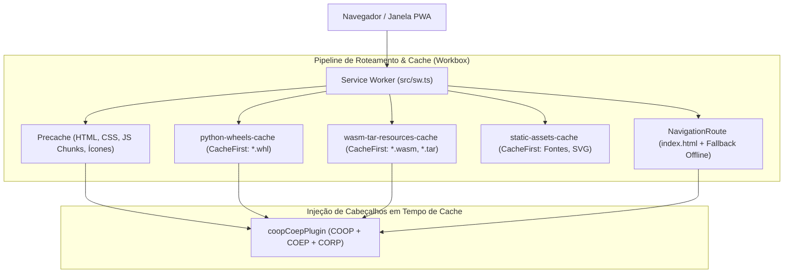

# ⚡ 07_OFFLINE_AND_PWA.md — Service Worker, Ciclo de Vida Offline e Estratégia PWA

> **TheProg Editor — Documentação Técnica Canônica**  
> *Versão do Sistema: `v0.6.0`*

---

## 1. Visão Geral da Arquitetura PWA

O **TheProg Editor** é construído como um **Progressive Web App (PWA) de Grau Industrial**, projetado para oferecer a mesma confiabilidade, velocidade e autonomia de uma aplicação instalada nativamente no sistema operacional.

### Pilares de Desempenho Offline:
1. **Cold Start Instantâneo (< 800ms):** A casca da IDE (Monaco Editor, Sidebar, Terminais) carrega imediatamente sem aguardar o download de compiladores pesados.
2. **Operação 100% Autônoma:** Uma vez que os runtimes necessários para os projetos do usuário forem baixados, a IDE opera de forma contínua mesmo em locais sem qualquer conexão à internet (modo avião, laboratórios isolados).
3. **Instalabilidade Standalone:** Suporte a instalação no Windows, macOS, Linux, ChromeOS e navegadores móveis, executando em janela própria sem barras de navegação do browser.



---

## 2. Estrutura do Service Worker ([`src/sw.ts`](file:///src/sw.ts))

O Service Worker é configurado através da estratégia `injectManifest` do plugin `vite-plugin-pwa` no [`vite.config.ts`](file:///vite.config.ts).

### 2.1 Injeção Dinâmica de Cabeçalhos de Isolamento (`coopCoepPlugin`)
Como o Service Worker intercepta e serve respostas armazenadas no Cache Storage, essas respostas poderiam perder os cabeçalhos de segurança configurados no servidor web original. O plugin personalizado `coopCoepPlugin` reconstitui esses cabeçalhos em cada resposta entregue:

```typescript
const coopCoepPlugin: WorkboxPlugin = {
  handlerWillRespond: async ({ response }) => {
    if (!response || response.status === 0) return response;
    const newHeaders = new Headers(response.headers);
    newHeaders.set('Cross-Origin-Opener-Policy', 'same-origin');
    newHeaders.set('Cross-Origin-Embedder-Policy', 'require-corp');
    newHeaders.set('Cross-Origin-Resource-Policy', 'cross-origin');
    return new Response(response.body, {
      status: response.status,
      statusText: response.statusText,
      headers: newHeaders,
    });
  },
};
```

### 2.2 Estratégias de Cache Dedicadas

| Rota / Padrão | Estratégia | Cache Name | Finalidade |
| :--- | :--- | :--- | :--- |
| **`self.__WB_MANIFEST`** | Precache | `workbox-precache-v2-...` | Assets principais gerados pelo Vite (bundle JS, CSS, index.html). Teto de 150 MB. |
| **`.*\.whl$`** | `CacheFirst` | `python-wheels-cache` | Pacotes Python puros (`micropip`, `black`, `packaging`, bibliotecas de usuário). |
| **`.*\.(?:wasm\|tar\|bin)$`** | `CacheFirst` | `wasm-tar-resources-cache` | Binários compilados WebAssembly e sistemas de arquivos arquivados. |
| **Imagens / Fontes** | `CacheFirst` | `static-assets-cache` | Fontes Woff2, ícones SVG e PNG de alta resolução. |
| **`NavigationRoute`** | Custom Handler | — | Intercepta navegações para `index.html` com fallback garantido se offline. |

---

## 3. Arquitetura de Lazy Loading de Runtimes

Compiladores e interpretadores completos são bibliotecas volumosas:
- YoWASP Clang LLVM: ~105 MB.
- Pyodide CPython: ~30 MB.
- esbuild-wasm: ~9 MB.

Para não penalizar o carregamento inicial da IDE com um download de mais de 140 MB no primeiro segundo:

1. **Casca Inicial Instantânea:** O arquivo principal `index.html` carrega apenas o shell da aplicação, Monaco Editor e utilitários básicos.
2. **Download sob Demanda:** O download de cada runtime só é acionado quando o usuário **abre ou clica em executar** um arquivo da respectiva extensão:
   - Se o desenvolvedor trabalha apenas em Python, o Clang de 105 MB **nunca é baixado**.
   - Se o desenvolvedor trabalha apenas em C/C++, o Pyodide não consome sua banda nem armazenamento.
3. **Feedback Visual:** O botão de execução na [`TitleBar.tsx`](file:///src/components/layout/TitleBar.tsx) exibe o progresso em tempo real ("Baixando Clang 45%...") enquanto o restante da interface permanece totalmente utilizável.

---

## 4. Persistência de Pacotes Python Offline (`.theprog/py-packages/`)

Quando o desenvolvedor instala pacotes via `micropip` no console Python:
- O serviço [`pythonPackages.ts`](file:///src/services/pythonPackages.ts) salva as wheels baixadas na pasta `.theprog/py-packages/` do workspace.
- O Service Worker intercepta o arquivo `.whl` e o armazena na chave `python-wheels-cache`.
- Em sessões subsequentes (mesmo sem internet), a rotina de boot do Python inspeciona o diretório local e reinstala os pacotes diretamente do cache local, garantindo que `import numpy` ou `import requests` continue funcionando offline.

---

## 5. Hooks de Integração PWA

### 5.1 Instalação do PWA ([`usePwaInstall.ts`](file:///src/hooks/usePwaInstall.ts))
- Captura o evento nativo `beforeinstallprompt` do navegador.
- Disponibiliza a função `install()` e a flag `isInstallable` para a interface.
- Exibe o botão **"Instalar App"** na barra de título apenas quando o navegador indicar suporte à instalação.

### 5.2 Monitoramento de Conectividade ([`useNetworkStatus.ts`](file:///src/hooks/useNetworkStatus.ts))
- Monitora os eventos `window.addEventListener('online')` e `window.addEventListener('offline')`.
- Atualiza o indicador de conectividade no rodapé da aplicação, informando ao desenvolvedor quando a aplicação está operando em modo offline puro.

---

## 6. Teste Automatizado de Execução Offline via CDP ([`e2e-offline.mjs`](file:///scripts/e2e-offline.mjs))

Para garantir que nenhuma alteração de código quebre a capacidade offline do TheProg Editor, o repositório conta com um teste E2E automatizado:
1. Sobe o preview da aplicação (`npm run preview`).
2. Conecta o Puppeteer com Chrome DevTools Protocol (CDP).
3. Aguarda o Service Worker instalar e ativar o precache completo.
4. Desativa a rede simulando desconexão física:
   ```javascript
   await client.send('Network.emulateNetworkConditions', {
     offline: true,
     latency: 0,
     downloadThroughput: 0,
     uploadThroughput: 0,
   });
   ```
5. Recarrega a página (`page.reload()`).
6. Valida se a interface do Monaco Editor e a Sidebar renderizam com sucesso a partir do cache e executa uma compilação de teste em C/C++ sem rede.

---

## 7. Mapeamento de Arquivos do Subsistema

- Service Worker Workbox: [`src/sw.ts`](file:///src/sw.ts)
- Configuração do VitePWA: [`vite.config.ts`](file:///vite.config.ts)
- Gerenciador de Pacotes Python: [`src/services/pythonPackages.ts`](file:///src/services/pythonPackages.ts)
- Hook de Instalação PWA: [`src/hooks/usePwaInstall.ts`](file:///src/hooks/usePwaInstall.ts)
- Hook de Rede: [`src/hooks/useNetworkStatus.ts`](file:///src/hooks/useNetworkStatus.ts)
- Script de Validação E2E Offline: [`scripts/e2e-offline.mjs`](file:///scripts/e2e-offline.mjs)
- Script de Download de Wheels Python: [`scripts/fetch-pyodide-extras.mjs`](file:///scripts/fetch-pyodide-extras.mjs)
