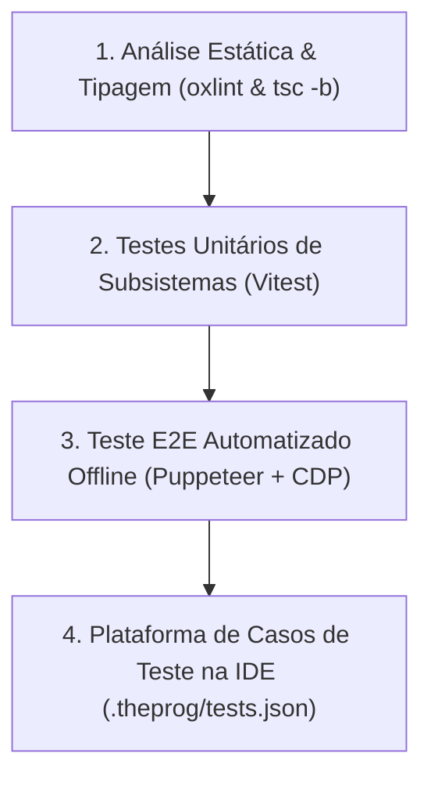

# 🧪 09_TESTING_AND_VERIFICATION.md — Qualidade, Suíte de Testes e Validação E2E

> **TheProg Editor — Documentação Técnica Canônica**  
> *Versão do Sistema: `v0.6.0`*

---

## 1. Pirâmide de Qualidade e Verificação

A estabilidade do **TheProg Editor** é garantida através de quatro níveis complementares de verificação contínua:



---

## 2. Nível 1: Análise Estática & Tipagem

### 2.1 Linter de Alta Performance (`oxlint`)
Executa verificações de sintaxe, regras do React 19 e boas práticas em menos de 300 ms:
```bash
npm run lint
```
- **Meta:** 0 erros.
- Alertas de `react(set-state-in-effect)` e dependências de hooks devem ser avaliados com rigor para não introduzir renderizações em cascata desnecessárias.

### 2.2 Checagem de Compilação TypeScript
Valida os contratos de tipo de todos os componentes, services e workers:
```bash
./node_modules/.bin/tsc -b
# ou
npm run build
```

---

## 3. Nível 2: Suíte de Testes Unitários (`vitest`)

Os testes unitários utilizam o **Vitest** com suporte nativo a módulos ES e TypeScript:
```bash
npm test
```

### 3.1 Mapeamento da Cobertura de Testes

| Arquivo de Teste | Módulo Testado | Casos Cobertos |
| :--- | :--- | :--- |
| [`treeIndex.test.ts`](file:///src/services/fileTree/treeIndex.test.ts) | File Explorer 2.0 | Linearização $O(V)$, compactação de pastas de filho único, profundidade virtual e ordenação (pastas primeiro). |
| [`pathUtils.test.ts`](file:///src/services/fileTree/pathUtils.test.ts) | Utilitários de Caminho | Resolução de caminhos aninhados (`a/b/c/main.c`), normalização de barras e cálculo de ancestrais. |
| [`processManager.test.ts`](file:///src/services/process/processManager.test.ts) | Gerenciador de Processos | Atribuição de PIDs monotônicos, fila FIFO de stdin, ciclo de vida (`spawning` → `running` → `terminated`) e cancelamento forçado (`Ctrl+C`). |
| [`vfs.test.ts`](file:///src/services/vfs/vfs.test.ts) | Virtual File System | Operações de `VFile`, streaming de chunks de bytes, conversão segura de texto e integridade binária. |
| [`gitClient.test.ts`](file:///src/services/git/gitClient.test.ts) | Git Client RPC | Inicialização de repositório, cálculo de status de modificações, staging e histórico de commits. |
| [`registry.test.ts`](file:///src/services/languages/registry.test.ts) | Registry de Linguagens | Detecção correta de extensões, classificação de `FileKind` e associação com runtimes. |
| [`runCapability.test.ts`](file:///src/services/languages/runCapability.test.ts) | Capacidade de Execução | Regras que definem se um arquivo pode ser executado, compilado ou apenas visualizado. |
| [`testRunner.test.ts`](file:///src/services/testRunner.test.ts) | Runner de Algoritmos | Cálculo de vereditos automáticos (Accepted, Wrong Answer, Time Limit Exceeded e Runtime Error). |
| [`fsSync.test.ts`](file:///src/workers/fsSync.test.ts) | Sincronização de Workers | Propagação de eventos de arquivos criados dentro do ambiente WASI para o editor. |

---

## 4. Nível 3: Teste E2E Offline com Chrome DevTools Protocol ([`scripts/e2e-offline.mjs`](file:///scripts/e2e-offline.mjs))

Para validar a garantia de funcionamento PWA offline no mundo real, o repositório possui um script automatizado que interage com o navegador via Puppeteer:

```bash
npm run e2e:offline
```

### 4.1 Roteiro de Execução do Teste:
1. Inicia um servidor local com os arquivos de produção construídos (`npm run preview`).
2. Abre uma instância limpa do Chromium sem cache prévio.
3. Carrega a página inicial e aguarda o Service Worker registrar e finalizar o download do precache (`workbox`).
4. Envia comando ao Chrome DevTools Protocol (CDP) forçando desconexão de rede total:
   ```javascript
   await client.send('Network.emulateNetworkConditions', {
     offline: true,
     latency: 0,
     downloadThroughput: 0,
     uploadThroughput: 0,
   });
   ```
5. Recarrega a página em modo offline (`page.reload()`).
6. Valida que:
   - A casca da IDE, a barra lateral e o Monaco Editor renderizam normalmente.
   - O código é compilado e executado pelo WebAssembly sem emitir requisições de rede com falha.

---

## 5. Nível 4: Plataforma de Casos de Teste na IDE ([`TestRunnerPanel.tsx`](file:///src/components/layout/TestRunnerPanel.tsx))

Para auxiliar estudantes, concorrentes de maratonas de programação e competidores da Olimpíada Brasileira de Informática (OBI), o TheProg Editor conta com um runner de testes integrado ao console:

### 5.1 Especificação do `.theprog/tests.json`
Os casos cadastrados pelo usuário são persistidos e versionados automaticamente na raiz do projeto:
```json
[
  {
    "id": "case-1",
    "name": "Exemplo Básico 1",
    "input": "4 2\n",
    "expectedOutput": "6\n",
    "timeoutMs": 2000
  },
  {
    "id": "case-2",
    "name": "Caso de Borda com Negativos",
    "input": "-5 10\n",
    "expectedOutput": "5\n",
    "timeoutMs": 2000
  }
]
```

### 5.2 Motor de Avaliação e Vereditos ([`testRunner.ts`](file:///src/services/testRunner.ts))
Cada caso é executado sequencialmente através do [`ProcessManager`](file:///src/services/process/processManager.ts), alimentando a entrada padrão via FIFO e interceptando a saída do terminal:

| Veredito | Sigla | Critério de Avaliação | Interface Visual |
| :--- | :--- | :--- | :--- |
| **Accepted** | **AC** | A saída obtida é estritamente idêntica à esperada (ignorando apenas espaços em branco no final da linha). | Badge verde com tempo de execução em milissegundos. |
| **Wrong Answer** | **WA** | A saída difere do gabarito esperado. | Badge vermelho com visualizador de diff inline mostrando discrepâncias. |
| **Time Limit Exceeded** | **TLE** | A execução ultrapassa o limite de tempo configurado (`timeoutMs`). | Badge amarelo; o processo é finalizado via `terminate()`. |
| **Runtime Error** | **RE** | O processo encerra com código de saída diferente de zero ou emite falha/trap de WASI. | Badge roxo com código de saída e stack trace capturada. |

---

## 6. Checklist de Regressão Pré-Release

Antes de publicar qualquer nova versão de produção, verifique manualmente:
- [ ] `npm run lint` executa com **0 erros**.
- [ ] `npm run build` conclui sem erros de TypeScript e respeita os chunks vendorizados no Vite.
- [ ] Execução de um programa em **C** com `scanf()` e `printf()`.
- [ ] Execução de um programa em **Python** com `input()` e importação de módulo padrão.
- [ ] Execução de um programa em **TypeScript** com importação relativa de módulo local.
- [ ] Cancelamento forçado de loop infinito com `Ctrl+C` sem travamento da aba.
- [ ] Criação de arquivo com caminho aninhado (`a/b/c.c`).
- [ ] Teste de gravação e recarga em pasta física via File System Access API.
