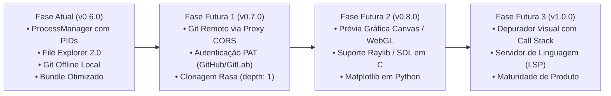

# 🗺️ 10_ROADMAP_AND_DEBT.md — Histórico de Auditorias, Débitos Técnicos e Roadmap Futuro

> **TheProg Editor — Documentação Técnica Canônica**  
> *Versão do Sistema: `v0.6.0`*

---

## 1. Histórico de Evolução Arquitetural (v0.5.0 → v0.6.0)

O **TheProg Editor** passou por uma transformação profunda entre as versões `v0.5.0` e `v0.6.0`.  
Uma auditoria sistêmica exaustiva de produto e engenharia (documentada em [`AUDITORIA_SISTEMICA.md`](file:///AUDITORIA_SISTEMICA.md) e [`A_CORRIGIR.md`](file:///A_CORRIGIR.md)) identificou e solucionou **29 inconsistências críticas, altas e médias** que impediam a estabilidade de longo prazo.

### 1.1 Resumo dos Principais Marcos Superados na v0.6.0

1. **Eliminação de Perda de Dados:**
   - Proteção de arquivos $> 5\text{ MB}$ com `kind: 'too_large'` no disco físico, impedindo truncamento destrutivo por auto-save.
   - Preservação estrita de arquivos binários gerados durante execuções (`Uint8Array`), eliminando a corrupção por decodificação UTF-8 forçada.
   - Correção na exportação de projetos em arquivo `.zip`, preservando imagens e arquivos compilados.
2. **Reengenharia de Concorrência & Processos:**
   - Criação do [`ProcessManager`](file:///src/services/process/processManager.ts) com PIDs monotônicos, substituindo variáveis globais frágeis (`isExecuting`).
   - Fila FIFO com backpressure para `SharedArrayBuffer` e `Atomics`, impedindo perda de dados em digitação veloz ou colagem de blocos de código multilinha.
   - Resolução garantida de Promises na interrupção de WebAssembly, desarmando vazamentos de memória e travamentos permanentes (`hang`).
3. **Segurança de Execução:**
   - Implementação de `sanitizeGlobalScope()` no [`jsWorker.ts`](file:///src/workers/jsWorker.ts), revogando acessos a `indexedDB`, `caches`, `fetch` e `Worker` por scripts do usuário.
4. **Otimização Extrema de Bundle (Redução de 93% no Script Inicial):**
   - Configuração de `manualChunks` no [`vite.config.ts`](file:///vite.config.ts) segregando bibliotecas em chunks vendorizados (`vendor-monaco`, `vendor-xterm`, `vendor-git`, `vendor-ui`).
   - O chunk de entrada principal caiu de **5,24 MB para 686 kB** (188 kB gzipped), acelerando o TTI para menos de 800 ms.
   - Purga do emulador x86 legado e remoção de `v86.wasm` (**2,10 MB**), expurgando assets obsoletos do precache.
5. **Subsistema Git 100% Offline:**
   - Implementação de [`GitEngine`](file:///src/services/git/gitEngine.ts) com persistência em IndexedDB (`git_fs`), staging, branches, commits e Monaco DiffEditor.

---

## 2. Débitos Técnicos Residuais & Oportunidades de Refatoração

Abaixo, os débitos técnicos de severidade baixa e melhorias contínuas de governança de código mapeadas para manutenção:

| Item | Arquivo / Módulo | Descrição do Débito | Impacto / Ação Sugerida |
| :--- | :--- | :--- | :--- |
| **1** | [`EditorContext.tsx`](file:///src/context/EditorContext.tsx) | Exportação de hook `useEditor` e tipos no mesmo arquivo do componente `EditorProvider`. | Gera alerta do React Fast Refresh (`react(only-export-components)`). Extrair o hook e contextos para arquivos dedicados. |
| **2** | [`Sidebar.tsx`](file:///src/components/layout/Sidebar.tsx) | Validação de caracteres inválidos de sistema de arquivos no input de criação de arquivos. | Reforçar regex para barrar explicitamente caracteres proibidos no Windows (`: * ? " < > \|`) em caminhos compostos. |
| **3** | [`wasmWorker.ts`](file:///src/workers/wasmWorker.ts) / [`jsWorker.ts`](file:///src/workers/jsWorker.ts) | Buffer de entrada no terminal limitado a 65.520 bytes por pacote. | Adicionar fragmentação dinâmica para payloads gigantes colados de uma única vez no terminal. |
| **4** | [`EditorArea.tsx`](file:///src/components/layout/EditorArea.tsx) | Dependências de atalhos de teclado (`handleRun`, `handleFormat`) omitidas no `useEffect` de keydown. | Refatorar para usar refs de funções atualizadas, mantendo conformidade estrita com `react-hooks/exhaustive-deps`. |

---

## 3. Roadmap Estratégico de Evolução Futura

### 3.1 Git Remoto via Proxy CORS Stateless (Fase 1 do Roadmap)
- Conforme planejado em [`ESTUDO_E_TODO_GIT.md`](file:///ESTUDO_E_TODO_GIT.md):
  - Publicação de um micro-worker na Cloudflare que adiciona os cabeçalhos de CORS e COEP necessários.
  - Modal `GitAuthModal.tsx` para entrada de credenciais e tokens com retenção temporária na sessão.
  - Habilitação dos comandos `git clone`, `git push` e `git pull` diretamente na interface do TheProg Editor.

### 3.2 Visualizador de Gráficos e Canvas (Fase 2 do Roadmap)
- Adição de aba ou visualizador de Canvas HTML5 para exibição de saídas gráficas:
  - **C / C++:** Suporte a bibliotecas gráficas portadas para WebAssembly (como Raylib ou SDL2 compiladas com emscripten/Clang).
  - **Python:** Renderização direta de plots gerados com `matplotlib` ou imagens processadas via `Pillow`.

### 3.3 Depuração Visual Interativa Passo-a-Passo (Fase 3 do Roadmap)
- Evolução do [`DebuggerManager`](file:///src/services/debugger/debuggerManager.ts):
  - Atualmente gerencia breakpoints visuais por linha de arquivo.
  - Implementar inspeção ativa de escopo de variáveis e call stack em tempo real durante a execução em Python e WASI.

### 3.4 Language Server Protocol (LSP) em Web Workers (Fase 4 do Roadmap)
- Integração de servidores de linguagem baseados em WebAssembly (como `clangd` compilado para Wasm ou Pyright) rodando em workers secundários para prover:
  - Renomeação segura de símbolos através de múltiplos arquivos (*Refactor / Rename*).
  - Busca precisa de referências (*Go to Definition*, *Find All References*).
  - Diagnósticos semânticos com mensagens de erro completas em tempo real antes da compilação.
