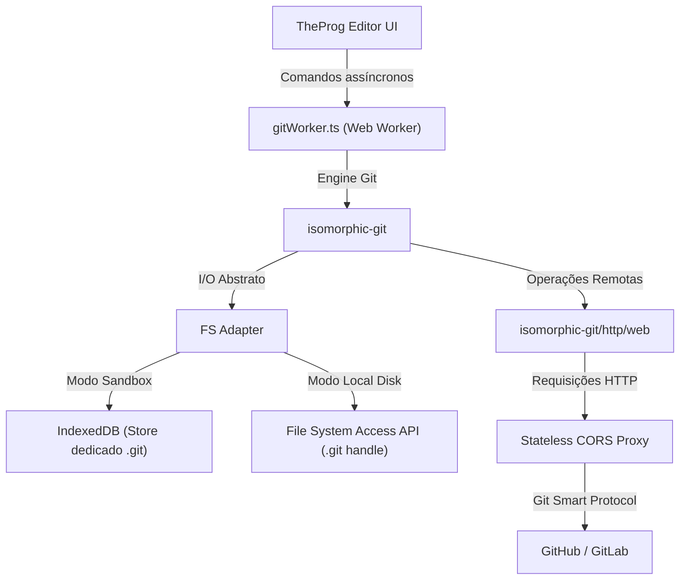

# ESTUDO_E_TODO_GIT.md — Estudo de Viabilidade Arquitetural e Roadmap de Implementação do Git no Navegador

> **Projeto:** TheProg Editor (v0.5.0)  
> **Autor:** Engenharia de Sistemas & Arquitetura WebAssembly / Web APIs  
> **Premissa Inegociável:** Operação 100% no cliente, preservação da arquitetura offline-first, privacidade e sandbox estrita (`COOP`/`COEP`).

---

## 📑 Sumário Executivo

O presente documento estabelece a análise técnica, o diagnóstico da base de código atual e o plano pragmático de implementação para prover ao **TheProg Editor** recursos completos de controle de versão Git no navegador.

Embora o projeto já conte com um protótipo conceitual utilizando `isomorphic-git` no componente `GitPanel.tsx`, a solução atual opera exclusivamente sobre memória volátil (`Map` em RAM), não persiste o diretório `.git` entre recarregamentos, bloqueia a thread de interface durante operações de hashing e não possui mecanismo para contornar as restrições de CORS e transporte TCP/SSH inerentes aos navegadores web.

Este estudo detalha como superar cada um desses limites e transformar o TheProg Editor em uma estação de trabalho compatível com o ecossistema Git sem violar sua filosofia *zero backend*.

---

## 1. 🔍 Diagnóstico da Codebase Existente

### 1.1 Mapeamento de Arquivos e Implementações Atuais

| Arquivo | Linhas | Papel Atual no Projeto | Diagnóstico Técnico |
|---|---|---|---|
| [`src/services/git/gitClient.ts`](file:///C:/Users/matheus.ferreira/Desktop/theprog-editor/src/services/git/gitClient.ts) | 262 | Fachada de integração com `isomorphic-git` e implementação de `GitMemoryFs`. | **Incompleto e Volátil:** Utiliza um mapa em memória (`Map<string, Uint8Array>`). Nenhum commit ou branch sobrevive ao F5. Executa na thread principal do React. |
| [`src/services/git/gitClient.test.ts`](file:///C:/Users/matheus.ferreira/Desktop/theprog-editor/src/services/git/gitClient.test.ts) | 48 | Testes unitários com Vitest validando `init`, `syncWorkspace`, `status` e `log`. | **Testa apenas a simulação em RAM:** Válido para validar a sintaxe da biblioteca, mas oculta os desafios reais de I/O e persistência. |
| [`src/components/layout/GitPanel.tsx`](file:///C:/Users/matheus.ferreira/Desktop/theprog-editor/src/components/layout/GitPanel.tsx) | 193 | Painel de UI do Git na barra lateral. | **Superficial:** Não possui staging (`git add` individual), não abre Monaco Diff Editor ao clicar no arquivo modificado e commita todos os arquivos cegamente. |
| [`src/components/layout/ActivityBar.tsx`](file:///C:/Users/matheus.ferreira/Desktop/theprog-editor/src/components/layout/ActivityBar.tsx) | 100 | Barra de atividades lateral com botão `GitBranch`. | **Funcional:** Permite alternar entre Explorador e GitPanel, mas sem badges numéricos de alterações pendentes. |
| [`src/services/localFs.ts`](file:///C:/Users/matheus.ferreira/Desktop/theprog-editor/src/services/localFs.ts) | 479 | Leitura e escrita física via File System Access API. | **Exclusão Ativa de `.git`:** A constante `IGNORED_DIRECTORIES` contém `.git`. O editor ignora o repositório existente no disco e não o conecta ao `gitClient`. |
| [`src/services/storage.ts`](file:///C:/Users/matheus.ferreira/Desktop/theprog-editor/src/services/storage.ts) | 265 | Camada de persistência IndexedDB (tabela `files`, `settings`, `vmCache`). | **Sem suporte a `.git`:** Apenas objetos da IDE (`FileItem`) são salvos. O grafo de objetos do Git (`.git/objects`, `refs`, `index`) não é persistido. |
| [`package.json`](file:///C:/Users/matheus.ferreira/Desktop/theprog-editor/package.json) | 54 | Manifesto de dependências do projeto. | Contém `"isomorphic-git": "^1.42.2"` nas dependências diretas. |
| [`README.md`](file:///C:/Users/matheus.ferreira/Desktop/theprog-editor/README.md) | 197 | Documentação pública oficial da IDE. | **Omissão Total:** Nenhuma menção a Git, visto que a funcionalidade foi classificada como protótipo experimental. |

### 1.2 Fragilidades Arquiteturais Identificadas

1. **Amnésia de Sessão (RAM-Only):**
   - O `GitMemoryFs` reside na heap do JavaScript. Ao atualizar a página ou alternar de workspace, todo o histórico de commits, a árvore de objetos e as referências desaparecem.
2. **Bloqueio da UI (Thread Principal):**
   - O cálculo de hashes SHA-1 e a compressão/descompressão zlib de arquivos para montar a árvore do Git são executados diretamente na main thread. Em workspaces com mais de 20 arquivos ou fontes volumosas, a UI congela e a digitação no Monaco engasga.
3. **Ausência de Área de Staging (*Index*):**
   - O método `commit()` em `gitClient.ts` executa `git.add()` em todos os arquivos modificados indistintamente. Não há como o desenvolvedor fazer commits parciais ou escolher quais arquivos versionar.
4. **Desconexão com o Disco Físico (File System Access API):**
   - Quando o usuário abre uma pasta local do computador contendo um repositório Git real, o TheProg Editor ignora a pasta `.git` para proteger a árvore de arquivos, mas não fornece uma ponte para que o `GitClient` leia os commits e branches existentes naquele repositório físico.
5. **Falta de Visualização de Diff:**
   - Clicar em um arquivo com status `M` no `GitPanel` apenas chama `openFile(targetFile.id)`. O usuário não consegue ver as linhas alteradas, adicionadas ou removidas.
6. **Inexistência de Operações Remotas:**
   - Não há suporte a `clone`, `pull`, `push` ou `fetch`.

---

## 2. ⚖️ Matriz de Viabilidade Técnica no Navegador

Abaixo, a avaliação minuciosa da viabilidade de cada comando Git no ambiente de sandbox do navegador (Chrome, Edge, Firefox, Safari):

| Comando | Nível de Viabilidade no Navegador | Complexidade | Dependências Necessárias | Observações de Engenharia |
|---|---|---|---|---|
| `git init` | 🟢 **100% Client-Side** | Baixa | `isomorphic-git`, Storage Adapter | Criação de `.git/HEAD`, `.git/config` e `.git/objects/`. Execução instantânea e puramente local. |
| `git status` | 🟢 **100% Client-Side** | Média | `isomorphic-git`, Web Worker | Compara o `index` (staged), o commit `HEAD` e o working tree. Deve rodar em Worker com *debounce* para não degradar a digitação. |
| `git add` | 🟢 **100% Client-Side** | Baixa | `isomorphic-git` | Calcula SHA-1, comprime o blob no formato loose object e grava a entrada no arquivo `.git/index`. |
| `git reset` / unstage | 🟢 **100% Client-Side** | Baixa | `isomorphic-git` | Remove o arquivo do `.git/index` sem alterar o conteúdo no working tree. |
| `git commit` | 🟢 **100% Client-Side** | Média | `isomorphic-git` | Cria o objeto árvore (`tree`), cria o objeto commit com autor, timestamp, mensagem e atualiza o ponteiro de branch (`refs/heads/*`). |
| `git log` | 🟢 **100% Client-Side** | Baixa | `isomorphic-git` | Percorre os nós de commit a partir de `HEAD` via ponteiros de parentesco. Rápido e de baixo consumo de memória. |
| `git diff` | 🟢 **100% Client-Side** | Média | `isomorphic-git`, Monaco Diff Editor | Compara o blob do working tree com o blob armazenado no commit `HEAD` ou no `index` e plota o visualizador de diferenças do Monaco. |
| `git branch` (checkout / switch) | 🟢 **100% Client-Side** | Média | `isomorphic-git`, VFS Sync | Criar branches é apenas escrever em `refs/heads/`. Fazer checkout exige sincronizar os arquivos do working tree e atualizar o estado do editor. |
| `git clone` | 🟡 **Requer Proxy CORS** | Alta | `isomorphic-git/http/web`, Proxy CORS, PAT | Utiliza o protocolo Git Smart HTTP (`/info/refs?service=git-upload-pack`). Exige proxy para contornar a ausência de CORS no GitHub/GitLab. |
| `git fetch` / `pull` | 🟡 **Requer Proxy CORS** | Alta | `isomorphic-git/http/web`, Proxy CORS, Algoritmo de 3-way merge | Baixa packfiles remotos via proxy e mescla alterações na branch local. Requer resolução de conflitos na interface. |
| `git push` | 🟡 **Requer Proxy CORS** | Alta | `isomorphic-git/http/web`, Proxy CORS, PAT (Token) | Envia packfile gerado localmente para o endpoint `/git-receive-pack` via HTTP POST. Requer autenticação por token de acesso pessoal. |
| `git` via SSH (`git@...`) | 🔴 **Inviável no Navegador** | Extrema | *N/A (Impossível nativamente)* | Navegadores **não possuem APIs para sockets TCP puros**. Não é possível estabelecer conexões SSH (porta 22) diretamente do client-side. |

---

## 3. 🏛️ Estudo Crítico de Engenharia e Desafios Técnicos

### 3.1 Desafio 1: Engine Git em JavaScript (`isomorphic-git`) vs. Wasm (`libgit2`)

#### Análise Comparativa:
1. **Compilação de C/C++ para WebAssembly (`libgit2-wasm` ou `git.wasm`):**
   - **Tamanho:** O binário gerado com Emscripten varia entre **12MB e 28MB**.
   - **Overhead de Memória:** Exige o sistema de arquivos virtual do Emscripten (`MEMFS` ou `IDBFS`), gerando sincronizações em bloco caras e cópias duplicadas na memória.
   - **I/O Síncrono:** As APIs do `libgit2` são síncronas bloqueantes em C, exigindo a biblioteca *Asyncify* do Emscripten, o que infla o código Wasm e reduz a performance em até 50%.
   - **Rede em Wasm:** Binários Wasm continuam presos à sandbox do navegador; requisições de rede precisariam passar por bindings JS com os mesmos limites de CORS.
2. **Biblioteca JavaScript Pura (`isomorphic-git`):**
   - **Tamanho:** ~220KB gzipped (extremamente compacto).
   - **Modularidade:** Totalmente assíncrono (Promises), com interface de sistema de arquivos e cliente HTTP plugáveis.
   - **Compatibilidade:** Suporta a especificação formal de objetos Git (commits, tags, trees, loose objects, packfiles v2 e delta-packs).



> **Decisão Arquitetural:** Adotar o **`isomorphic-git`** como engine oficial. Para evitar travamento de interface durante a compressão zlib e cálculo de SHA-1, a engine deve ser **100% isolada em um Web Worker dedicado (`gitWorker.ts`)**, carregado de forma preguiçosa (*lazy-loaded*) apenas quando o usuário interagir com o controle de versão.

---

### 3.2 Desafio 2: Estrutura e Persistência do Diretório `.git`

O Git armazena seu estado em uma estrutura rígida no diretório `.git`:
- `HEAD`: Aponta para a ref atual (ex: `ref: refs/heads/main`).
- `config`: Configurações de repositório, branches e remotes.
- `index`: Arquivo binário de staging que mapeia o working tree aos SHA-1 dos blobs.
- `objects/`: Armazenamento content-addressable com hash SHA-1 de 40 caracteres, dividido em dois primeiros dígitos para o subdiretório e 38 dígitos para o arquivo (ex: `objects/4b/825dc642cb...`), além de `pack/` (`.pack` e `.idx`).
- `refs/`: Ponteiros de branches locais (`refs/heads/*`), tags (`refs/tags/*`) e remotes (`refs/remotes/*`).

#### Como Persistir nos Dois Ambientes do TheProg Editor?

#### A. Ambiente Sandbox (IndexedDB):
- **Problema:** A tabela atual `files` do `idb` é projetada para arquivos do usuário (`FileItem`), que são exibidos na árvore do explorador. Misturar objetos do `.git` causaria explosão de nós na interface.
- **Solução Arquitetural:** 
  - Utilizar a biblioteca oficial `@isomorphic-git/lightning-fs` ou construir um `GitIdbFsAdapter` conectado a uma **objectStore dedicada** no IndexedDB (`theprog_git_fs`), completamente separada da árvore de arquivos do editor.
  - Ao sincronizar o workspace (`git add`), o `gitWorker` lê os arquivos do editor e grava os blobs do Git na store do IndexedDB.

#### B. Ambiente Local Disk (File System Access API):
- **Problema:** Quando o usuário clica em "Abrir Pasta do Computador", a pasta `.git` já existe fisicamente no disco dele.
- **Solução Arquitetural:**
  - `localFs.ts` deve continuar ignorando `.git` na varredura da árvore visual (`files`), para que o usuário não veja milhares de arquivos de objetos na sidebar.
  - No entanto, o `FileSystemDirectoryHandle` raiz da pasta do projeto deve ser fornecido ao adapter de sistema de arquivos do Git.
  - O adapter acessa `.git` diretamente através de:
    ```typescript
    const gitDirHandle = await rootDirHandle.getDirectoryHandle('.git', { create: false });
    ```
  - Dessa forma, qualquer commit feito no TheProg Editor grava os objetos diretamente na pasta `.git` real do computador do usuário, tornando o repositório perfeitamente legível pelo terminal local (`git log`, `git status` no VS Code/Bash).

---

### 3.3 Desafio 3: Operações Remotas (CORS, TCP e Autenticação)

Este é o desafio mais complexo em uma IDE web cliente.

#### 1. Por que o Git Remoto falha diretamente no navegador?
O Git utiliza o **Smart HTTP Transfer Protocol**. Quando você executa um `git clone https://github.com/usuario/repo.git`, o cliente faz as seguintes chamadas HTTP:
1. `GET https://github.com/usuario/repo.git/info/refs?service=git-upload-pack`
2. `POST https://github.com/usuario/repo.git/git-upload-pack` (com negociação de commits/haves/wants e download do packfile streaming).

Ao tentar disparar esses requests diretamente pelo navegador via `fetch()`:
- **Bloqueio de CORS:** Os servidores do GitHub e GitLab **não retornam** o cabeçalho `Access-Control-Allow-Origin: *`. O navegador bloqueia a resposta imediatamente.
- **Isolamento de Origem (`COOP`/`COEP`):** Como o TheProg Editor roda com `Cross-Origin-Embedder-Policy: require-corp` (necessário para `SharedArrayBuffer` do terminal interativo e WebAssembly threads), mesmo que o GitHub respondesse com CORS, o navegador exigiria `Cross-Origin-Resource-Policy: cross-origin`.

```text
┌─────────────────────────┐               ┌──────────────────────────────┐
│  Navegador (TheProg)    │               │  GitHub / GitLab / Bitbucket │
│  COOP: same-origin      │   (BLOQUEADO) │  info/refs?service=...       │
│  COEP: require-corp     │ ────────────X │  Sem cabeçalhos CORS         │
└─────────────────────────┘               └──────────────────────────────┘
            │                                             ▲
            │ (Permitido via Proxy)                       │
            ▼                                             │
┌─────────────────────────┐                               │
│ Stateless CORS Proxy    │ ──────────────────────────────┘
│ (Cloudflare Worker)     │   Encaminha payload bruto e
│ Adiciona CORS + CORP    │   retorna stream sem persistir
└─────────────────────────┘
```

#### 2. Solução Arquitetural: Proxy CORS Stateless na Borda
Para preservar o modelo client-side sem manter servidores pesados de computação:
- **Cloudflare Worker Stateless (Edge):**
  - Um script de aproximadamente 40 linhas rodando na borda (CDN).
  - Ele apenas intercepta o request, reencaminha os headers e o corpo binário para o GitHub/GitLab, e anexa à resposta:
    ```http
    Access-Control-Allow-Origin: *
    Access-Control-Allow-Methods: GET, POST, OPTIONS
    Access-Control-Allow-Headers: Content-Type, Authorization, User-Agent, X-Git-Protocol
    Access-Control-Expose-Headers: Content-Type, X-Git-Update-Result
    Cross-Origin-Resource-Policy: cross-origin
    ```
  - **Segurança e Privacidade:** O proxy é **estéril** (zero logs, zero banco de dados). Ele apenas retransmite streams de bytes.
  - **Autonomia do Desenvolvedor:** O TheProg Editor fornecerá um campo nas Configurações permitindo que o usuário aponte para sua própria URL de proxy Cloudflare (que possui cota gratuita de 100.000 requisições/dia).

#### 3. Autenticação Segura (Personal Access Tokens - PAT):
- Senhas de conta foram descontinuadas pelo GitHub; conexões HTTPS exigem **Personal Access Token** (Classic ou Fine-Grained).
- **Tratamento de Tokens no Cliente:**
  - Nunca salvar tokens permanentemente em texto puro no `localStorage`.
  - Armazenar o token na memória de sessão (`sessionStorage` ou estado do `gitWorker`), sendo descartado ao fechar a aba.
  - Solicitar o token via modal seguro ("Autenticação Git") apenas quando uma operação de `clone`, `pull` ou `push` for disparada.

---

### 3.4 Desafio 4: Integração com a UI, Performance e Monaco Diff

#### A. Detecção Reativa de Repositório sem Perda de Performance
- Não varrer recursivamente o projeto para descobrir se há Git.
- Verificar apenas a raiz:
  - No Sandbox: checar se existe a chave `HEAD` no store do Git.
  - No Disco Local: checar se `await rootDirHandle.getDirectoryHandle('.git')` resolve sem lançar `NotFoundError`.
- Caso exista: ativar a aba de Source Control e carregar o estado.
- Caso não exista: exibir no `GitPanel` uma tela de boas-vindas com botão destacado: **"Inicializar Repositório Git Local"** (`git init`).

#### B. Badges de Status na Árvore de Arquivos
- **O que NÃO fazer:** Disparar `git.status()` a cada caractere digitado no editor. Isso tornaria a digitação impraticável.
- **O que fazer:**
  1. Manter um cache `gitStatusMap: Map<string, 'M' | 'A' | 'D' | 'U'>` no estado da IDE.
  2. Atualizar o mapa apenas quando:
     - O usuário salva o arquivo (`Ctrl+S` ou debounce de auto-save).
     - Ocorre criação, exclusão ou renomeação de arquivo.
     - O usuário foca ou abre a aba do Git.
  3. No componente `Sidebar.tsx`, ler o status de cada item em tempo O(1) através de `gitStatusMap.get(file.path)` e renderizar um indicador visual sutil (ex.: `M` âmbar, `U` verde, `D` vermelho) ao lado do nome do arquivo.

#### C. Visualizador de Diff Integrado (Monaco Diff Editor)
- O `@monaco-editor/react` fornece nativamente o componente `<DiffEditor />`.
- Ao clicar em um arquivo modificado no painel do Git:
  1. O editor busca o conteúdo original no commit `HEAD` via `gitClient.readAtCommit(filepath, 'HEAD')`.
  2. Abre uma aba especial de Diff no `EditorArea.tsx`:
     - **Lado Esquerdo (Original):** Conteúdo do commit `HEAD` (somente leitura).
     - **Lado Direito (Modificado):** Conteúdo atual do working tree (editável).

---

## 4. 📋 Roadmap Estruturado de Implementação (`TODO`)

---

### 🟢 FASE 1: Reconhecimento e Operações Locais Básicas (Offline-First)
*Objetivo: Capacitar o TheProg Editor a inicializar repositórios, versionar arquivos, criar commits e manter o histórico persistido tanto no Sandbox (IndexedDB) quanto no Disco Local (File System Access API).*

#### Tarefa 1.1: Web Worker Dedicado do Git (`gitWorker.ts`) e RPC Bridge
- **Descrição Técnica:**
  - Isolar todo o ciclo de vida do `isomorphic-git` em um Web Worker para desonerar a thread principal.
  - Criar protocolo de mensagens baseado em RPC com Promises tipadas:
    ```typescript
    export type GitWorkerRequest =
      | { type: 'INIT'; payload: { dir: string } }
      | { type: 'STATUS'; payload: { files: Array<{ path: string; content?: string }> } }
      | { type: 'STAGE'; payload: { filepath: string } }
      | { type: 'UNSTAGE'; payload: { filepath: string } }
      | { type: 'COMMIT'; payload: { message: string; author: GitAuthor } }
      | { type: 'LOG'; payload: { depth?: number } }
      | { type: 'DIFF'; payload: { filepath: string } };
    ```
- **Critério de Aceite (DoD):**
  - Nenhuma operação de SHA-1, zlib ou manipulação de packfile é executada na thread de UI.
  - A digitação no editor permanece a 60fps mesmo durante o cálculo de status de dezenas de arquivos.
- **Potencial Gargalo de Performance & Mitigação:**
  - *Gargalo:* Transferência de strings de arquivos grandes entre main thread e worker via `postMessage`.
  - *Mitigação:* Enviar apenas metadados (tamanho e mtime) para verificação rápida; transferir conteúdo integral somente quando o mtime diferir do índice do Git.
- **Arquivos a Criar / Modificar:**
  - `[NOVO]` [`src/workers/gitWorker.ts`](file:///C:/Users/matheus.ferreira/Desktop/theprog-editor/src/workers/gitWorker.ts)
  - `[MODIFICAR]` [`src/services/git/gitClient.ts`](file:///C:/Users/matheus.ferreira/Desktop/theprog-editor/src/services/git/gitClient.ts)

---

#### Tarefa 1.2: Camada de Persistência Híbrida do Diretório `.git`
- **Descrição Técnica:**
  - Implementar um adapter de sistema de arquivos para o `isomorphic-git` com suporte aos dois modos do TheProg Editor:
    1. **Modo Sandbox:** Persistência em store dedicada do IndexedDB (`theprog_git_fs`), garantindo que o diretório `.git` sobreviva a recarregamentos de página.
    2. **Modo Local:** Leitura e escrita direta no handle `.git` via File System Access API.
- **Critério de Aceite (DoD):**
  - No modo Sandbox, após criar commits e recarregar o navegador com `F5`, o histórico de commits e o status do repositório permanecem intactos.
  - No modo Local, um commit gerado na interface do TheProg Editor cria objetos válidos no diretório `.git` físico no disco do computador.
- **Potencial Gargalo de Performance & Mitigação:**
  - *Gargalo:* Latência de transações do IndexedDB gravando múltiplos *loose objects*.
  - *Mitigação:* Manter um cache LRU em memória no worker para nós acessados frequentemente (`HEAD`, `index`, refs).
- **Arquivos a Criar / Modificar:**
  - `[NOVO]` [`src/services/git/gitStorageAdapter.ts`](file:///C:/Users/matheus.ferreira/Desktop/theprog-editor/src/services/git/gitStorageAdapter.ts)
  - `[MODIFICAR]` [`src/services/storage.ts`](file:///C:/Users/matheus.ferreira/Desktop/theprog-editor/src/services/storage.ts)
  - `[MODIFICAR]` [`src/services/localFs.ts`](file:///C:/Users/matheus.ferreira/Desktop/theprog-editor/src/services/localFs.ts)

---

#### Tarefa 1.3: Suporte a Staging Real (`git add`, `git reset`, `git restore`)
- **Descrição Técnica:**
  - Separar visualmente e funcionalmente as alterações em duas listas:
    1. **Alterações Preparadas para Commit (*Staged Changes*):** Arquivos adicionados ao índice.
    2. **Alterações Não Preparadas (*Working Tree Changes*):** Arquivos modificados no editor mas ainda fora do stage.
  - Implementar botões de ação individual por arquivo:
    - `+` (*Stage*): executa `git.add({ filepath })`.
    - `-` (*Unstage*): remove do índice mantendo o conteúdo no editor.
    - `↩` (*Descartar Alterações*): reverte o arquivo para o estado do commit `HEAD`.
- **Critério de Aceite (DoD):**
  - O botão de commit só é habilitado se houver pelo menos um arquivo no stage e uma mensagem válida.
  - É possível commitar apenas um subconjunto dos arquivos modificados.
- **Potencial Gargalo de Performance & Mitigação:**
  - *Gargalo:* Reescrita do arquivo `.git/index` a cada clique de stage.
  - *Mitigação:* Otimização interna do `isomorphic-git` com escrita atômica do arquivo index em buffer contíguo.
- **Arquivos a Criar / Modificar:**
  - `[MODIFICAR]` [`src/components/layout/GitPanel.tsx`](file:///C:/Users/matheus.ferreira/Desktop/theprog-editor/src/components/layout/GitPanel.tsx)
  - `[MODIFICAR]` [`src/services/git/gitClient.ts`](file:///C:/Users/matheus.ferreira/Desktop/theprog-editor/src/services/git/gitClient.ts)

---

#### Tarefa 1.4: Detecção Inteligente e Comando `git init`
- **Descrição Técnica:**
  - Ao carregar um workspace, verificar de forma assíncrona e não intrusiva se o projeto possui repositório Git.
  - Se não houver repositório, o painel exibe uma tela informativa com orientações didáticas sobre controle de versão e o botão **"Inicializar Repositório Git"**.
  - O comando `git init` cria a estrutura base, define o branch inicial como `main` e adiciona um commit inicial opcional.
- **Critério de Aceite (DoD):**
  - Workspaces recém-criados exibem o estado vazio elegante com um clique para inicializar.
  - Repositórios clonados ou abertos localmente identificam o branch atual e os commits existentes automaticamente.
- **Arquivos a Criar / Modificar:**
  - `[MODIFICAR]` [`src/components/layout/GitPanel.tsx`](file:///C:/Users/matheus.ferreira/Desktop/theprog-editor/src/components/layout/GitPanel.tsx)

---

### 🟡 FASE 2: Visualização e UX na IDE
*Objetivo: Integrar as informações do Git fluidamente ao Monaco Editor e ao Explorador de Arquivos.*

#### Tarefa 2.1: Monaco Diff Editor Integrado
- **Descrição Técnica:**
  - Adicionar suporte a abas de diff no [`EditorArea.tsx`](file:///C:/Users/matheus.ferreira/Desktop/theprog-editor/src/components/layout/EditorArea.tsx).
  - Ao clicar em um arquivo modificado na lista do Git, abrir a visão de comparação lado a lado utilizando o componente `<DiffEditor />` do Monaco.
  - Lado esquerdo: conteúdo recuperado via `gitClient.readAtCommit(path, 'HEAD')`.
  - Lado direito: conteúdo atual do arquivo em edição.
- **Critério de Aceite (DoD):**
  - Adições aparecem destacadas em verde e remoções em vermelho.
  - Modificações digitadas no painel da direita refletem instantaneamente no arquivo do editor.
- **Potencial Gargalo de Performance & Mitigação:**
  - *Gargalo:* Instanciação pesada de dois modelos Monaco concorrentes.
  - *Mitigação:* Destruir modelos de diff imediatamente ao fechar a aba para evitar vazamento de memória.
- **Arquivos a Criar / Modificar:**
  - `[MODIFICAR]` [`src/components/layout/EditorArea.tsx`](file:///C:/Users/matheus.ferreira/Desktop/theprog-editor/src/components/layout/EditorArea.tsx)
  - `[MODIFICAR]` [`src/types/editor.ts`](file:///C:/Users/matheus.ferreira/Desktop/theprog-editor/src/types/editor.ts) (estender `EditorTab` com `isDiff?: boolean; diffOriginalContent?: string`)

---

#### Tarefa 2.2: Badges Reativos e Debounced na Árvore de Arquivos
- **Descrição Técnica:**
  - Integrar o mapa de status do Git ao [`Sidebar.tsx`](file:///C:/Users/matheus.ferreira/Desktop/theprog-editor/src/components/layout/Sidebar.tsx).
  - Arquivos modificados exibem a letra `M` âmbar, novos arquivos exibem `U` verde e arquivos com staging exibem `A`.
  - Adicionar contador numérico de arquivos pendentes diretamente no ícone `GitBranch` da [`ActivityBar.tsx`](file:///C:/Users/matheus.ferreira/Desktop/theprog-editor/src/components/layout/ActivityBar.tsx).
- **Critério de Aceite (DoD):**
  - Badges atualizam automaticamente após salvamento de arquivo.
  - Zero impacto perceptível no desempenho da árvore durante navegação por teclado.
- **Arquivos a Criar / Modificar:**
  - `[MODIFICAR]` [`src/components/layout/Sidebar.tsx`](file:///C:/Users/matheus.ferreira/Desktop/theprog-editor/src/components/layout/Sidebar.tsx)
  - `[MODIFICAR]` [`src/components/layout/ActivityBar.tsx`](file:///C:/Users/matheus.ferreira/Desktop/theprog-editor/src/components/layout/ActivityBar.tsx)

---

#### Tarefa 2.3: Seletor de Branches e Criação de Ramos
- **Descrição Técnica:**
  - Adicionar no topo do `GitPanel` um seletor suspenso exibindo a branch atual (ex.: `main`).
  - Permitir criar nova branch a partir de `HEAD` ou alternar para branches existentes via `git.checkout()`.
- **Critério de Aceite (DoD):**
  - Alternar de branch atualiza o working tree e recarrega os arquivos abertos no editor.
- **Arquivos a Criar / Modificar:**
  - `[MODIFICAR]` [`src/components/layout/GitPanel.tsx`](file:///C:/Users/matheus.ferreira/Desktop/theprog-editor/src/components/layout/GitPanel.tsx)

---

### 🔵 FASE 3: Operações Remotas (Clone, Pull, Push)
*Objetivo: Permitir sincronização com GitHub/GitLab superando os bloqueios de CORS e COEP da plataforma web.*

#### Tarefa 3.1: Proxy CORS Stateless (Cloudflare Workers) & Suporte a COEP/CORP
- **Descrição Técnica:**
  - Desenvolver e disponibilizar a receita do Cloudflare Worker para encaminhamento transparente do Smart HTTP do Git:
    ```javascript
    export default {
      async fetch(request) {
        if (request.method === 'OPTIONS') {
          return new Response(null, { headers: corsHeaders });
        }
        const url = new URL(request.url);
        const targetUrl = url.searchParams.get('url');
        if (!targetUrl) return new Response('Missing url', { status: 400 });

        const clientReq = new Request(targetUrl, {
          method: request.method,
          headers: request.headers,
          body: request.body,
          redirect: 'follow'
        });

        const res = await fetch(clientReq);
        const newHeaders = new Headers(res.headers);
        newHeaders.set('Access-Control-Allow-Origin', '*');
        newHeaders.set('Cross-Origin-Resource-Policy', 'cross-origin');
        newHeaders.set('Access-Control-Expose-Headers', '*');

        return new Response(res.body, {
          status: res.status,
          statusText: res.statusText,
          headers: newHeaders
        });
      }
    };
    ```
  - Configurar `isomorphic-git/http/web` com parâmetro `corsProxy`.
- **Critério de Aceite (DoD):**
  - Requisições HTTP para endpoints Git remotos não são bloqueadas por CORS nem pelo cabeçalho `COEP: require-corp` da aplicação.
- **Arquivos a Criar / Modificar:**
  - `[NOVO]` [`scripts/git-cors-proxy-worker.js`](file:///C:/Users/matheus.ferreira/Desktop/theprog-editor/scripts/git-cors-proxy-worker.js)
  - `[MODIFICAR]` [`src/components/modals/SettingsModal.tsx`](file:///C:/Users/matheus.ferreira/Desktop/theprog-editor/src/components/modals/SettingsModal.tsx) (campo para configurar URL do proxy)

---

#### Tarefa 3.2: Modal de Autenticação Segura e Gerenciamento de PAT
- **Descrição Técnica:**
  - Criar modal `GitAuthModal.tsx` que solicita `Token de Acesso Pessoal (PAT)` e `Nome de Usuário`.
  - Instruções didáticas detalhadas na UI sobre como gerar um token no GitHub (escopos: `repo`, `read:org`).
  - Armazenamento em `sessionStorage` com opção de salvar em memória apenas durante a sessão ativa.
- **Critério de Aceite (DoD):**
  - Tokens nunca são enviados para nenhum servidor que não seja o endpoint de destino do Git através do proxy HTTPS criptografado.
- **Arquivos a Criar / Modificar:**
  - `[NOVO]` [`src/components/modals/GitAuthModal.tsx`](file:///C:/Users/matheus.ferreira/Desktop/theprog-editor/src/components/modals/GitAuthModal.tsx)

---

#### Tarefa 3.3: Comandos de Sincronização Remota (`clone`, `pull`, `push`)
- **Descrição Técnica:**
  - **`git clone`:** Modal "Clonar Repositório Git" permitindo colar a URL HTTPS do repositório. O processo baixa os packfiles com barra de progresso percentual e popula o workspace.
  - **`git push`:** Empacota os commits locais e envia via `git.push()` para a branch remota configurada.
  - **`git pull`:** Executa `git.pull()`, detecta conflitos e atualiza o working tree.
- **Critério de Aceite (DoD):**
  - Clonar um repositório público do GitHub popula os arquivos no editor sem falhas.
  - Fazer commit e push com token atualiza a branch no repositório remoto.
- **Potencial Gargalo de Performance & Mitigação:**
  - *Gargalo:* Descompressão de repositórios grandes com histórico longo.
  - *Mitigação:* Usar `singleBranch: true` e profundidade rasa configurável (`depth: 1` por padrão para clonagem rápida).
- **Arquivos a Criar / Modificar:**
  - `[MODIFICAR]` [`src/services/git/gitClient.ts`](file:///C:/Users/matheus.ferreira/Desktop/theprog-editor/src/services/git/gitClient.ts)
  - `[MODIFICAR]` [`src/components/layout/GitPanel.tsx`](file:///C:/Users/matheus.ferreira/Desktop/theprog-editor/src/components/layout/GitPanel.tsx)

---

## 5. 🎯 Conclusão e Próximos Passos Recomendados

A auditoria técnica confirma que **o suporte a Git 100% no navegador é perfeitamente viável**, desde que sejam respeitados os pilares arquiteturais definidos:
1. **Engine em Worker:** Manter `isomorphic-git` estritamente isolado da UI em `gitWorker.ts`.
2. **Persistência Confiável:** Substituir a memória volátil por IndexedDB no Sandbox e handles reais no disco físico.
3. **Ponte de Borda:** Utilizar um proxy CORS stateless para transpor as limitações de rede do navegador em operações remotas.

Recomenda-se iniciar a execução pela **Fase 1 (Operações Locais e Persistência)**, garantindo que a experiência local seja impecável e livre de bugs antes de introduzir as complexidades de rede da Fase 3.
